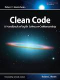
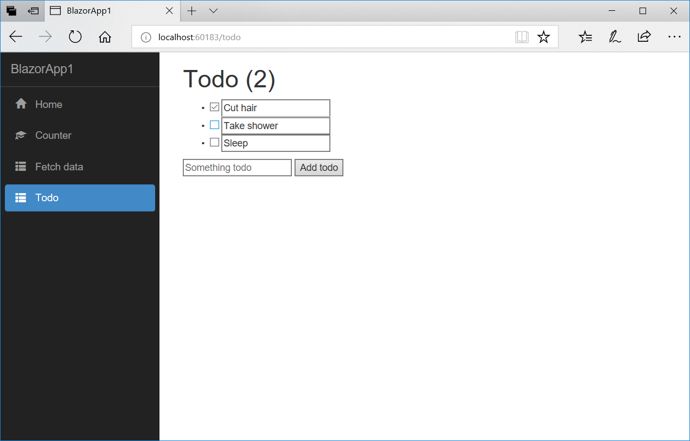
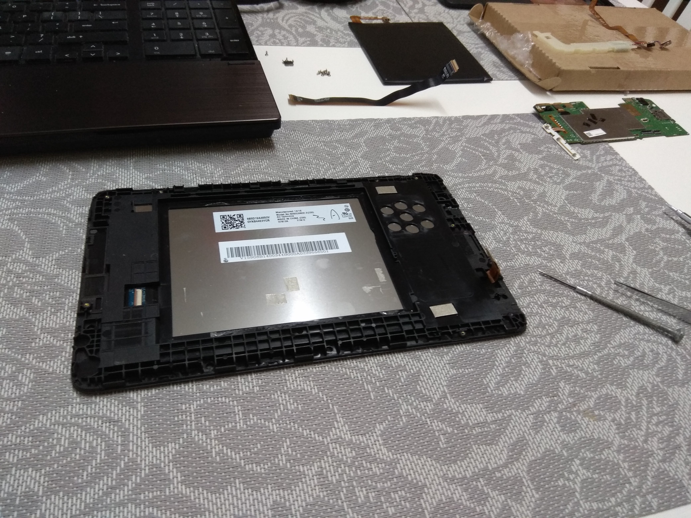

Welcome to my first weekly development post about my adventure to the world of never ending profesional improvement. In this series I will try to keep a track and reflect some of my weekly learnings, work progress and along with it share my thoughts and opinions.

### Work 
* Started rewriting a Reporting project front-endside  from Angular 1.5 to React, redux, saga. Added .NET Core project and configured proxy;
* Managed to fix quite a few nasty bugs about redirects, url formatting, encoding between the several different projects;
* Set products default quantity to 1 when adding product from catalog;
* Cash register errors;
* Show services in the cash register without price;
* In the new recipe, when it is signed or saved remain in the patient recipes tab;
* In the creating services module, price field must be editable when price is not found in the catalog;
* Update converter with decimalAdjust function;
* In the creating services module, total amount is NaN. Refactoring selling get function to always return value instead of null;
* In the cash regiter module, new orders are not refreshed on the IE browser;
* Unemployment module routing;
* In the old web system "Return" button shows that page is not found;
* Error tab component reloading, total count of the errors from client-side form, server errors and errors saved in the database from the communication with signalR;

### Meeting
* [Front-end Spring 2018. Kaunas](https://www.eventbrite.com/e/front-end-spring-2018-kaunas-tickets-44983562045#) - Meetup talks: 1. "Migrating Website to React. Feature by Feature. No Downtime.", 2. "Google PageSpeed Is a Lie. Measuring Real Page Speed".

### Books
This week I started reading [Clean Code: A Handbook of Agile Software Craftsmanship by Robert C. Martin](https://www.goodreads.com/book/show/3735293-clean-code) - Read from 0 to 48 page. Completed chapters about clean code, meaningful names and functions. A small summary of these chapters:

### Programming
I am quite interested in this "Blazor" project. Managed to touch and experience all the features which blazor gives for myself. Looking forward to the new releases. 
* https://github.com/aspnet/samples/tree/master/samples/aspnetcore/blazor
* https://blogs.msdn.microsoft.com/webdev/2018/03/22/get-started-building-net-web-apps-in-the-browser-with-blazor/
* https://blogs.msdn.microsoft.com/webdev/2018/04/17/blazor-0-2-0-release-now-available/

### Tinkering
My ordered touch screen from ebay has arrived this week. I finally replaced the cracked one with a new one. There was a lot of glass everywhere. The hardest part was to 
remove the glued touch screen from the plastic. It took about 2 hours without a proper heater and doing it manually by cracking the screen with a screwdriver along it sides. All in all it was messy fun. 

### Read articles
I've read a lot of blog posts which I was bookmarked over the last few weeks, but still I have much more articles to read in the weeks to come. 
* https://dev.to/aleccool213/the-best-parts-of-the-pragmatic-programmer---1om5
* https://dev.to/grahamlyons/why-my-development-environment-is-the-best-30ga
* https://dev.to/johnwoodruff91/epic-development-environment-using-windows-subsystem-forlinux-5f0n
* https://dev.to/ozymandias547/how-my-greenfield-projects-fall-into-muddy-messes-18pn
* https://dev.to/edoverflow/-automating-your-reconnaissance-workflow-with-meg-2koi
* https://dev.to/katafrakt/regular-expressions-how-do-they-work-1n55
* https://dev.to/worksofbarry/why-i-created-an-ide-4cj
* https://dev.to/borrrden/what-is-git-rebase-4h9a
* https://dev.to/borrrden/a-net-glossary-57l
* https://dev.to/lemuelcco/the-t-developer-440a - "Expert" it says "a person who is very knowledgeable about or skilful in a particular area."
One thing to take note is that getting good at a craft takes time but also we sometimes underestimate what we know and overestimate what others do. Sometimes try to teach a pure beginner about programming, it's at that point you might be able to reflect and see that you have actually acquired a lot of knowledge in your field.
Learning a new language can be daunting because we don't like that funny feeling of being a newbie, but it's alright, it's normal and actually, the experience you had with a former language goes with you when you learn a new one so your investments are not wasted. 
* https://dev.to/bosepchuk/how-simple-is-too-simple-to-test-2lh7 - Write tests for any behavior you care about.
* https://dev.to/iriskatastic/learn-to-code-with-live-streams-from-the-best-developers-5fk4
* https://dev.to/kayis/4-steps-i-took-to-remote-working-3ia - If it's everyone for theirselves, you won't be happy working from home.
* https://dev.to/bugfenderapp/18-tips-for-working-remotely-this-year--1f48
* https://dev.to/lefebvre/what-ive-learned-after-working-remotely-for-10-years-384j
* https://dev.to/bradymholt/things-i-have-learned-working-remotely-for-3-years-4ea7
* https://smallbusinessprogramming.com/code-review-checklist-prevents-stupid-mistakes/ - we needed automated testing combined with code reviews to catch this error.
* https://dev.to/fbnlsr/10-essential-extensions-for-vscode-174i
<!--stackedit_data:
eyJoaXN0b3J5IjpbLTIwMTQxMDk0NDldfQ==
-->