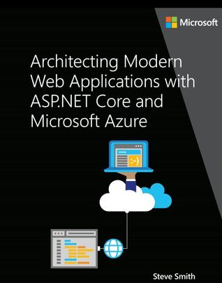

### Work 
* 

### Books

[Clean Code: A Handbook of Agile Software Craftsmanship by Robert C. Martin](https://www.goodreads.com/book/show/3735293-clean-code) - Read from 48 to ~ page. Completed chapters about Comments;

Read [Architecting Modern Web Applications with ASP.NET Core and Azure](https://www.goodreads.com/book/show/35699060-architecting-modern-web-applications-with-asp-net-core-and-azure) by Steve Smith.
"...with proper design, the features come cheaply. This approach is arduous, but continues to succeed." - Dennis Ritchie
Topics:
* Introduction
* Characteristics of Modern Web Applications
* Choosing Between Traditional Web Apps and SPAs
* Architectural Principles
* Common Web Application Architectures
* Common Client Side Technologies
* Developing ASP.NET Core MVC Apps
* Working with Data in ASP.NET Core Apps
* Testing ASP.NET Core MVC Apps
* Development Process for Azure-Hosted ASP.NET Core Apps
* Azure Hosting Recommendations for ASP.NET Core Web Apps

### Programming
* https://github.com/dotnet-architecture/eShopOnWeb

### Read articles
* https://dev.to/spboyer/getting-started-with-net-core-2bf9
* https://dev.to/drminnaar/docker-guide---part-1--57c8
* https://medium.com/the-mission/14-days-to-transform-your-life-growth-hack-your-way-to-the-life-youve-always-wanted-681253e97ed7
* https://dev.to/theobendixson/why-i-only-work-remotely-156d
* https://medium.com/svilenk/the-1-000-floor-elevator-why-most-designers-fail-googles-infamous-interview-design-challenge-a5ff9ad91741
* https://dev.to/fernandosmonter_80/thinking-your-profession-is-about-work-2nkn
* https://dev.to/lhuria94/keeping-it-clean-coding-standards-that-matter--4e5p
* https://dev.to/acro5piano/5-reasons-why-git-based-resume-is-awesome-127
* https://dev.to/kttravers/how-to-work-with-developers---a-guide-for-non-developers-35hk
* https://dev.to/renascent479/technical-interview-teardown-5b1c
