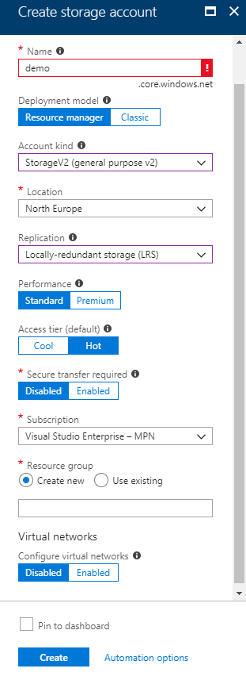
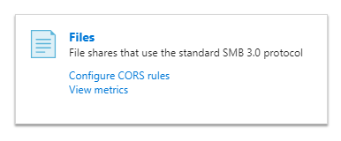
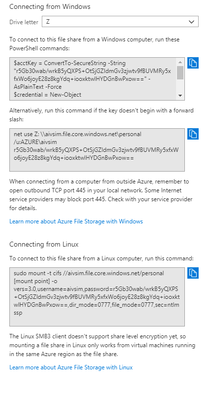

If by any means you are bored or unsatisfied with current cloud storage services like OneDrive, Google drive, Dropbox, etc., you have a possibility to create one for yourself and sync it accross different devices by using one of your favorite cloud service Azure, Amazon or many others.

I will explain it the least possible steps without sacrifising quality and saving your time how to do it yourself. 
For this guide I will be using Azure and Windows OS but the steps are the same for any other OS.

1. Register for an account here: https://portal.azure.com;

2. Create an Azure Storage account and access it:

2. Click on Files:

3. Click File share, add new item and access it:

4. Click Connect, review commands and execute them on your OS command line:

Now you've got your own personal disc drive which is even a bit cheaper than paid storage subscriptions. By inserting your storage network name (eg. \\\\aivsim.file.core.windows.net) you can use it on any device you want.
