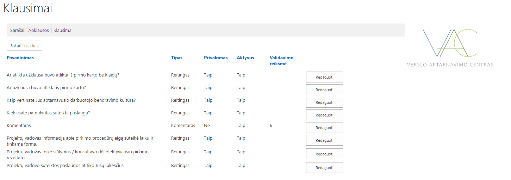
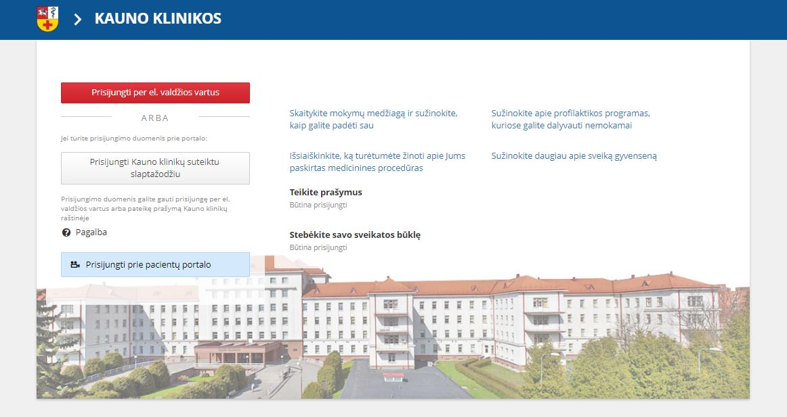

Currently I’m working as a **Full-Stack Web Developer** with **.NET Core, NodeJS, React, Redux, Redux saga, Typescript, ES7, Bootstrap 4.0** technologies. Interested in Blockchain methodologies, Etherium, ICON projects. Following the news, trying them out by developing some of the demo projects. 

<h2>Contents</h2>
<ul>
    <li>
        <a href="#workplaces">Workplaces</a>
    </li>
    <li>
        <a href="#workProjects">Work Projects</a>
    </li>
	<li>
        <a href="#stack">Stack</a>
    </li>
</ul>

<h2 id="workplaces">
    Workplaces
    <a href="#workplaces" aria-label="Anchor"> #</a>
</h2>

####Agersi Ltd

<figure class="float-right" style="width: 100px; margin: 0px">
	
</figure>

**Full-Stack Web Developer** 
*Feb 2018 – Present, Kaunas, Lithuania | Ireland*

- Developing: work with .NET Core 2.0, C# 7.0, Bootstrap 4, Typescript, ReactJS, Redux, Visual Studio, Visual Studio Code, MS SQL Server, Node.js, Webpack, Bitbucket. 
- Communicating: Remote work with day trips to the office. co-operation on projects with other companies. Managing a small team of several people. Daily meetings with testers, project managers, developers and team leads.

<a href="https://www.linkedin.com/company/agersi-ltd" target="_blank">Visit website</a> |
<a href="/experience/workplaces/agersi">My story in the company</a>

####Amidus

<figure class="float-right" style="width: 100px; margin: 0px">
	
</figure>

**Full-Stack Web Developer** 
*Jun 2014 – Jan 2018 (3 years 8 mos), Kaunas, Lithuania*

- Developing: work with .NET, .NET Core, C#, HTML5, CSS3, Bootstrap, JavaScript, Typescript, Jquery, KnockoutJS, AngularJS, React, Redux, Flux, D3, EF, Visual Studio, Visual Studio Code, MS SQL Server, Node.js, Webpack, Gulp, TFS, GIT technologies. Developing system, system modules, helping on task and project management.
- Communicating: Co-operation on projects with other companies. Meetings and communication between testers, project managers and other developers.

<a href="http://www.amidus.lt/about/" target="_blank">Visit website</a> |
<a href="/experience/workplaces/amidus">My story in the company</a>

####Callcredit Information Group

<figure class="float-right" style="width: 100px; margin: 0px">
	
</figure>

**Back-end Web Developer (Internship)** 
*Jul 2013 – Aug 2013 (2 mos), Kaunas, Lithuania*

- Developing: work with ASP.NET MVC, C#, T-SQL, HTML, CSS, JavaScript, Jquery, GIT, Visual Studio, Microsoft SQL Server, Windows forms reporting technologies to ensure project stated expectations.
- Communicating: work experience in a team consisting of 3 team members and nearly 18 assisting staff members. Meetings with team staff, business visionary. Use of Agile project management methodologies.
- Engineering: coding, peer review, unit test, documentation writing activities. Code deployment to QA environment.

<a href="https://www.callcredit.co.uk/about-us" target="_blank">Visit website</a> |
<a href="/experience/workplaces/callcredit">My story in the company</a>

<h2 id="workProjects">
    Work Projects
    <a href="#workProjects" aria-label="Anchor"> #</a>
</h2>

####E-Health services and cooperation infrastructure information system
*Apr 2017 – Present* 
<a href="/experience/projects/e-health-services-and-cooperation-infrastructure-information-system">Read more</a>

####Integration platform for the business processes of buyers and suppliers
*Nov 2014 – Apr 2017, Present - (provide support as advisor)* 

<figure style="border: 1px solid black">
	
</figure>

<a href="https://viacorex.com/" target="_blank">Visit website</a> | 
<a href="/experience/projects/integration-platform-for-the-business-processes-of-buyers-and-suppliers">Read more</a>

####Business service center procurement sharepoint site
*Jun 2016 – Jan 2017* 
<figure style="border: 1px solid black">
	
</figure>

* Created Sharepoint questionnaires solution to view, create and manage their own questionnaire types with various types of inputs;
* Created several types of fee report forms with dynamical field loading, settings and other various individual key features;

<a href="/experience/projects/business-service-center-procurement-sharepoint-site">Read more</a>

####Lithuania state forests management information system
*Apr 2015 – Oct 2015* 
<figure style="border: 1px solid black">
	
</figure>

* Ensured the optimization of forest management processes;
* Ensured the storage of all necessary data in a unified database, data transmission and integration with automated processes;
* Informaction is filled once and fully complies with its operational needs in management, control, analysis and reporting tasks;
* Control and analysis in all subsystems, data exchange between forest enterprises and other institutions;
* Operational availability of data and improved the satisfaction of informations need of users, in accordance with their rights;
* Data security and recovery opportunity;
* Report formation and control;
* Optimization of human resources.

<a href="/experience/projects/lithuanian-state-forests-management-information-system">Read more</a>

####Lithuania University of Health Sciences public health care services information system
*Jun 2014 – Apr 2015* 
<figure style="border: 1px solid black">
	
</figure>

* 4 services were transferred to the e-space: patient education, patient information and visits, patient services, remote monitoring of severe patients;
* The developed system modules improved Kaunas clinics provided health care services; 
* Created opportunities for cost savings, time and money;
* Reduced the administrative burden;
* Increased Kaunas clinics service availability and accessibility;
* Services created an added value for both patients and clinics workers;
* Designed and upgraded IS;
* Integrated IS with 3 other system groups.

<a href="https://portalas.kaunoklinikos.lt/" target="_blank">Visit website</a> |
<a href="/experience/projects/lithuanian-university-of-health-sciences-public-health-care-services-information-system">Read more</a>

####Employees evaluation information system 
*Jul 2013 – Aug 2013* 
<figure style="border: 1px solid black">
	
</figure>

* Improved data quality reduced the number of accuracy failures for about 4%;
* Evaluation system can be changed more easily when needed and it does not impact MI (Management Information) calculations;
* Decreased risk of missing possible risk, due to alerts and monotoring functions for data quality or processing issues;
* Efficiency savings were made by enhanced automation, which freed up some human resource in Consumer services team;
* Improved MI capability reduced time spent in calculating MI manually and reduced risk possibility;
* System perfectly copes with the amount of data ~3920 disputes per month;
* Data from all relevant sources (excel files) was loaded to system;
* All evaluations data is held in one place and accessible for everyone;
* MI and reporting are available for trend analysis;
* MI and reporting are available for daily/weekly/monthly/quarterly/yearly basis;
* Increased consumer satisfaction;
* Increased employee’s motivation to view MI;
* More user friendly;
* Easier to give feedback.

<a href="/experience/projects/employees-evaluation-system">Read more</a>

*All other individual Custom and Demo projects can be found on my <a href="https://github.com/aivsim" target="_blank">GitHub</a> page.*

<h2 id="stack">
    Stack
    <a href="#stack" aria-label="Anchor"> #</a>
</h2>

**CURRENT**:
*Full-Stack Web Developer*. 
**Technologies**: .NET Core, LINQ, Entity Framework, NodeJS, React, Redux, Redux saga, JavaScript, Typescript, ES7, Bootstrap 4.0, C#, HTML5, CSS3, TSQL, Webpack, GIT, TortoiseGIT. Azure 
**Tools**: Visual Studio 2017, Visual Studio Code, SQL Management Studio 2014, Profiler, Fiddler, Postman, Notepad++, Flux, Chrome DevTools, Redux DevTools, Atlassian Jira, Slack, Skype, Microsoft Teams, Outlook, Snipping tool, SummatraPDF, Office.

**PREVIOUS**:
*Full-Stack Web Developer*. 
**Technologies**: ASP.NET, ASP.NET MVC, Razor pages, Web Forms, Selenium / SoupUI, Telerik UI and Reporting, XML/XSLT, AJAX, Bootstrap (2.0-3.0), Knockout JS, Angular 1.5, JQuery, WCF, Sharepoint, OAuth Authentication, Entity Framework migrations, Gulp, Docker, JUnit 
**Tools**: Team Foundation Communication, Cisco System VPN Client, Internet Information Services (IIS), MedleyText, OneNote, Trello, Scrum for Trello, Pomodoro timer, Draw.io, Pomello, Sublime, Total Commander, Eclipse, Adobe Reader.