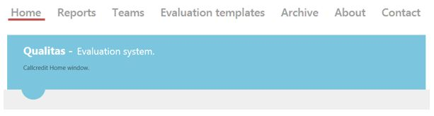

<figure>
	
</figure>

The goal of this system was to successfully implement evaluation system for Consumer Services team, which allowed reporting capabilities and automatisation in work.

<h2>Contents</h2>
<ul>
    <li>
        <a href="#businessProblems">1. Business problems</a>
    </li>
    <li>
        <a href="#solution">2. Solution</a>
    </li>
    <li>
        <a href="#results">3. Results</a>
    </li>
</ul>

<h2 id="businessProblems">
    1. Business problems
    <a href="#businessProblems" aria-label="Anchor"> #</a>
</h2>

In this system every Consumer Service Assistant (CSA) got checked on regular, weekly bases: **accuracy scores were affecting CSA bonus, pointed possible risk, and resolved possible risk of complaints**. However, of greater significance than the number of evaluated cases, was the way their evaluation processing was viewed/done by Team Leaders/Specialist saving possible amount of time.

With their, at that time, Evaluation system, they had a major problem - any cases that were being checked by Team Lead/Specialist were done **manually** using excel form. This **increased date loosing possibility, time consumption is higher, not user friendly, decrease disk space in server, risk of changing data, Management Information (MI) data has to be calculated manually with highly possible mistakes.** As the number of CST members were increasing and evaluations system, topics needed to be changed along with changing processes, it was hard to keep track of any changed information, calculate averages of accuracy rates for CST members, Teams, overall department. 

#### Monitoring, reporting, alerting
Consumer Services team evaluation process has been manual for past time, when FTE numbers increased its getting hard to control data and have in one place and format. As well it’s getting harder to be more consistent on scorings between the sites Kaunas/Leeds.
Capability to alert if any user is not achieving well, would help to spot specific CSA that needs additional support, help or training. Which is partially possible now, but there is a high risk that this person might be missed off. Another risk is that at present time we are not able to see average score for each of the topic that user has been scored per month/quarter/year. This automatically gives us only a high level view of actual results, but if CSA needs additional training it’s hard to specify on which area we should concentrate most. 
These algorithms and MI possibilities would help to spot main differences between sites, additional training requirements for the users and better calculations.

#### Visible comments 
Once evaluation is done evaluator writes a comment in the comments box explaining why specific score has been given to the user. This does not have to be visible in the MI, but historic data always has to be kept. It would be good if when opened specific scored case per CSA there would be a visibility of the comments that has been made. 

#### Separate scoring templates (topics)
At present each team within Consumer Services Team has separate scoring template. Qualitas has capability to have only one at present. Having capability to have more than one template would help to calculate averages for whole department not only within a team level. So far each team does not have visibility of different teams scores or/and main issues that team is facing. Qualitas would help out TL’s to spot any possible week areas trends across department. 

#### Access Securities
As mentioned before, separate teams do not have visibility of other teams, which does not create transparency. Everyone should be able to view mistakes that other CSA members made, but only evaluators should be able to evaluate and change scorings. Option to change level of accessibility should be applied as well. 

#### User forum
At present time only discussion that CSA members can have is only with TL’s or actual evaluators about their scoring. This is not useful as in different sites CSA don’t have specialised tool to have such discussion. This would help to maintain required communication level as well to have fewer discrepancies in scorings.

<h2 id="solution">
    2. Solution
    <a href="#solution" aria-label="Anchor"> #</a>
</h2>

**The main purpose of the new system was that it should be able to load historic data, be flexible in changing evaluation topics, have required Management Information filtered by User, Team, and Department on daily/weekly/monthly/quarterly/yearly bases, working risk alert system, and no manual excel datasheet documents filling**.

Work before system implementation was quite manual. Evaluation stages were roughly like these:
* Excel spread sheet with possible points for each scoring topic was created. 
* Spread sheet was loaded to the SHARE point for evaluators to use.
* Evaluators took spread sheet from SHARE point and created new weekly work sheet in excel file located in Z: drive for each user in Disputes team. 
* Evaluator scored each topic (accuracy section) as Yes (achieved) No (not achieved) which allowed excel to calculate overall score using formula, for user per a week. 
* Evaluator then filled, separate sheet for MI with number of cases scored, type of cases scored per week per a user.
* Evaluator keept averages in “performance appraisal sheet” and then was able to provide appropriate feedback and calculate bonuses. 

Business wanted to automate this process. Excel spread sheets have been used for 2 years now, therefore loading historic data to the system automatically was great solution to keep all data in one place.

#### Requirements examples
Ref | As |	I Want | So That | MoSCoW |	Size | Priorities
--- | --- | ----------- | --- | :---: | :---: |:---:
1	| Business visionary | I want to load historical evaluation data to new system | I could extract all employees  evaluation data reports	| Should | L | 6
2	| Business visionary | I want evaluation score calculation be fully automated |	I would not need calculate it manually | Must | | 1
2,1	| Business visionary | I want every item to be able to have different max score | evaluation would be easier and more accurate | Must |	M | 1
2,2	| Business visionary | I want percentage column added to section showing it's total score | I would get better view of evaluation |	Must | S | 1	
2,3	| Business visionary | I want to be able to save data with one click per one evaluation	| it would be easier to save data |	Should | S | 1
3	| Business visionary | I want to monitor poor performance and be alerted of poor performance | I would be aware that performance drops above specified percentage | Could | XS | 7
4	| Business visionary | I want evaluation reports to be extracted for certain departament, team and person per period | I could keep track of departments  and teams performance | Must | 2
4,1	| Business visionary | I want extract evaluation of department per period |	I could keep track of department's performance | Must |	M | 2	
4,2	| Business visionary | I want extract evaluation of team per period	| I could keep track of team's performance | Must | M | 2	
4,3	| Business visionary | I want extract evaluation of person per period |	I could keep track of person's performance | Must |	S | 2	
5	| Business visionary | I want to be able to comment each item when evaluating |	I can justify my evaluation	Must | XS |	4
6	| Business visionary | I want to be able to have different topics for different teams |	it can be used widely within CST | Must | L | 3
7	| Business visionary | I want to have possibility to manage users and privileges | I can remove or add users and give them required access rights |	Should | M | 5
8	| Business visionary | I want user forum created in spread sheet | So everyone would be able to discuss what main challenges they are facing with sample checking, why specific areas are scored as they are and other. | Won't | | -1

In our workplace we constructed our work around Agile methodologies, using a board, sticky notes for tasks, user stories, epics. All our team attended daily stand-up meetups in which we talked about what we had done the previous day, on what we will be working today and if we have any problems which got us stucked. Several work process examples you can view in the pictures below:

<figure>
	
	<figcaption>Example of a user story on a sheet of paper on our agile board</figcaption>
</figure>

<figure>
	 
	<figcaption>User story planning stage with evaluation by points</figcaption>
</figure>

<figure>
	
	<figcaption>Example of a user story and its formed tasks</figcaption>
</figure>

<figure>
	
	<figcaption>Example of a user story and its tasks analysis before actual development</figcaption>
</figure>

<figure>
	
	<figcaption>Retrospective of done work after two weeks sprint</figcaption>
</figure>

<figure>
	
	<figcaption>Burndown chart velocity</figcaption>
</figure>

Epic or User Story phase exit criteria was done in these steps:
* Backlog - story defined and sized;
* Evaluation - approch is agreed; User stories commonly understood; Acceptance criteria defined; Environment prepared;
* Engineering - Coding, peer review and unit tests completed; Tests prepared and data created; Deployment documentation updated;
* Verification - Code deployed to QA env.; Full test suite executed successfully; Outcomes reported to Project team;
* Done - All previous phases completed; Code passed Code deployed on Test env. and test passed;

#### Security Assessment
* This product adhered to the enterprise architecture coding standards.

#### Proposed Hardware and Software
Minimal Server requirements: **Windows 7 64 bit, 4 GB RAM, 40 GB HDD, 2 Core CPU, Internet information services 7.5, .NET Framework 4.5**
Recommended: **Windows Server 2008 R2 Web Edition, 8 GB RAM, 100 GB HDD, 4 Core CPU, Internet information Services 7.5, .NET Framework 4.5**

#### Proposed Architecture 
The project was being developed on **three virtual machines** connected to **testing environment** from which project was loaded to **live server**.

Capacity requirements: One filled topic required about 4kB space. In a month about 700 topics were filled. **So 35 MB of space was needed for one year**

Before deploying application it was packed to deployment package which included DB change script and application file. This package was used in pre-deployment testing.
There was used **SQL Server 2008 R2, IIS and .NET Runtime software**.

Solution goes in line with Call Credit current technical strategy, therefore no justification is required.

#### Technical and other Constraints
Project files and IIS configuration was exported to shared location.

**Database backup was done with SQL Server Management Studio 2008 using Simple database recovery method. Full backup was made weekly and differential backup was made daily.** Simple method was used because data is not critical and therefore full recovery method was not needed.
 
#### Development/Testing approach and principles
All new code adhered to standard **Stylecop** rules. **All new code was unit tested** with exception of repository functions. No continuous integration was used. Peer reviews were conducted. All new modules were developed in **Test Driven Development** manner where applicable. 
* Everyone was responsible for quality;
* Ensured visibility of all development and test work. Commits to GIT;
* Code was covered by Unit tests;
* Regression testing was done where possible;
* All project documents were uploaded to share drive;
* Technical solution documentation always was up to date;
* Each stage of coding had to be documented;

**Development and testing environment were using IIS (Internet Information Services), .Net 3.5 and SQL Server 2008 R2.**

#### Skills 
Estimated skill set used for this project: **ASP.NET, C#, HTML, CSS, JavaScript, TSQL, XML/XSLT, GIT**

Approach/Tools | Front-end | Back-end
--- |:---:|:---:
UI | Selenium / SoupUI | -
SQL Code (Stored procedures & SSIS packages) | - | Visual Studio
Integration	| TBA | TBA
UNIT | Visual Studio | Visual Studio

#### Roles and Responsibilities
Project Visionary, Project Sponsor, Project Manager, Technical Coordinator, Team Leader, Business Ambassador, Business Analyst, Infrastructure, Principal Developer, **Solution Developers (Me and my colleagues)**, Solution Testers, Business Advisors (Architect, DBA, Apps Support, Finance, CST/Ops, HR), Workshop Facilitator, DSDM Coach. **Overall ~5 Team members and ~10 other staff members.**

<h2 id="results">
    3. Results
    <a href="#results" aria-label="Anchor"> #</a>
</h2>

* Improved data quality reduced the number of accuracy failures for about 4%;
* Evaluation system can be changed more easily when needed and it does not impact MI calculations;
* Decreased risk of missing possible risk, due to alerts and monotoring functions for data quality or processing issues;
* Efficiency savings were made by enhanced automation, which freed up some human resource in Consumer services team;
* Improved MI capability reduced time spent in calculating MI manually and reduced risk possibility;
* System perfectly copes with the amount of data ~3920 disputes per month;
* Data from all relevant sources (excel files) was loaded to system;
* All evaluations data is held in one place and accessible for everyone;
* MI and reporting are available for trend analysis;
* MI and reporting are available for daily/weekly/monthly/quarterly/yearly basis;
* Increased consumer satisfaction;
* Increased employee’s motivation to view MI;
* More user friendly;
* Easier to give feedback;
* Work automatisation;

**We have avoided the risks** that have been diverted:
* Not enough time to complete user stories until Deadline;
* Priority for skilled team members was lowest;
* Developers working on this project might not have enough required skill;
* No environment for the complete product;
* No full time QA assigned;
* There was no one to support data loading, risk to the data quality;
* More noticeable accuracy single point failures for specific staff members will increase accuracy along with consumer satisfaction. 

<figure>
	
	<figcaption>Basic example of a generated report</figcaption>
</figure>

<figure>
	
	<figcaption>Basic example of team member performance evaluation</figcaption>
</figure>