<figure>
	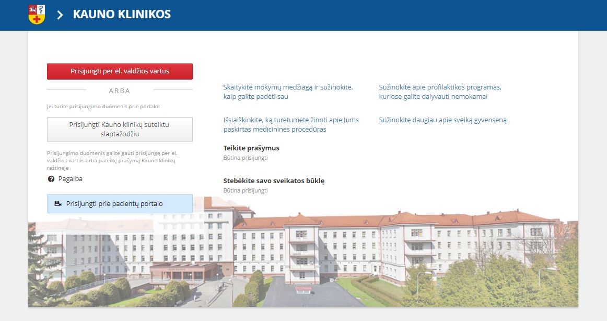 
</figure>

The main goal of the project was to improve quality, accessibility and availability of the Kaunas Clinic healthcare services by transferring them to web and the creation of new e-services. 

<a href="https://portalas.kaunoklinikos.lt/" target="_blank">Visit website</a>

<h2>Contents</h2>
<ul>
    <li>
        <a href="#businessProblems">1. Business problems</a>
    </li>
    <li>
        <a href="#solution">2. Solution</a>
    </li>
    <li>
        <a href="#results">3. Results</a>
    </li>
</ul>

<h2 id="businessProblems">
    1. Business problems
    <a href="#businessProblems" aria-label="Anchor"> #</a>
</h2>

During the implementation of this project it was planned to transfer several public healthcare services to the web environment. Chosen services were fragmented according to the needs of the target group and the specific activities of Kaunas clinics. Patients from all over Lithuania come here for a consultation. The following services were planned to be transferred:
* Patient education;
* Patient information and visits;
* Patient services;
* Remote monitoring of severe patients;

The provision of health care services on the internet - is a health management information system, which according to the customer's requirements has the desired health care services. The developed system modules would improve Kaunas clinics provided health care services, to create opportunities for cost savings, time and money, reduce the administrative burden and increase Kaunas clinics service availability and accessibility. The created healt care services will create an added value for both patients and clinics workers.

#### Patient education.
In order to prevent the development of serious chronic diseases, health care services are focused both on the treatment of ill patients and on the illness prevention. Kaunas Clinics are actively involved in teaching and educating patients - applying various diseases prevention measures (providing information and educational materials on the risk of illness chronic diseases, safety principles, information about the application of preventive measures opportunities in relation to individual needs, the impact of these measures, etc.) in this way ensuring the implementation of basic patient education and training goals.

#### Patient information and visits. 
After transferring the service to the web, the User must have information about the patient's preventive examinations, the time of hospitalization, reminders (by smartphone) of registered visits, information about the designated family doctor, new preventive programs, new equipment or new services provided in Kaunas clinics. Patients should have the opportunity to actively co-operate with the employees of Kaunas Clinics, to alert the staff of the institution about not being able to arrive in time for planned consultation or investigation for treatment. To that date, the above-mentioned questions were solved by telephone or there was no communication at all.

#### Patient services.
This service enabled the Kaunas Clinic Patients to participate actively in the electronic system - submit the requests and obtain copies of your own medical records.

#### Remote monitoring of severe patients.
The purpose of this service is to ensure the state of the Lithuanian population suffering from chronic forms of chronic diseases monitoring and control using electronic monitoring devices. This electronic service has to provide the opportunity for a patient, who is constantly monitored and advised by doctors in Kaunas clinics, by remotely providing them with detailed information about their state of health and the progress of their disease characterizing symptoms, long-term health monitoring indicators, that will identify and transmit data to system to special electronic monitoring devices. The service will allow Kaunas Clinic Doctor specialist to control the patient's condition remotely, when the family doctor's competence is inadequate. The system must be available to physicians, interactive, individualized, be able to change the treatment plan according to clinical status and changes in laboratory tests performed at other health care facilities (for example, chronic kidney patient with a history of changes in peritoneal dialysis machines, receive a response to a follow-up plan two days later). The project focuses on the provision of healthcare services electronically. Patients with chronic diseases can be divided into the following main groups:
* Oncologic patients;
* Endocrinologic patients;
* Nephrological patients;
* Pulmonary patients;
* Other chronic diseases. 

<h2 id="solution">
    2. Solution
    <a href="#solution" aria-label="Anchor"> #</a>
</h2>

Similar systems analysis, and technology analysis was made. Systems analysis was based on the selected criteria and it was decided whether it was worthwhile to develop such a system. Technology analysis comprised software analysis. Software analysis, based on the selected criteria were based on different technologies of database management systems, software libraries and standards, web services, and web application technologies. When the system analysis was done, system actors was defined (patient, doctor, specialist, worker, devices administrator, education administrator, server, communicating server) and use cases drawn functional system requirements. Also non-functional system requirements were defined. When requirements were done, components diagram, sequences diagrams, database schema and the class diagrams were created. With the project implemented in a prototype system, the report provides a realistic user interface views. The realized prototype was tested using the test plan and test cases. Individual components were tested by using black box approach and the integration of components were tested by using “bottom-up” integration testing method. The results describe what has been done.

<figure>
	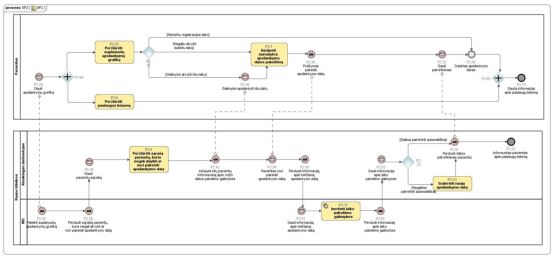
    <figcaption>Example of Use case diagram</figcaption>
</figure>

#### Requirements examples
System had **over 113 non-functional** and **over 430 functional requirements**.
Ofcourse I cannot talk about all of them, but I will list all the groups in which the requirements were grouped.

##### Non-functional requirements:
1) General requirements;
2) Requirements for activity analysis (report creation and generation) tools;
3) Requirements for the user interface;
4) Requirements for system administration;
5) General safety and audit requirements;
6) Requirements for performance and speed;
7) Quality requirements;
8) Requirements for a computer workstation;
9) Requirements for system availability and reliability;
10) Requirements for system expansion and licensing.

##### Functional requirements:
1) Requirements for electronic service:
    * Patient education;
    * Patient notification;
    * Customer service;
    * Severe patient remote sensing service;
2) Requirements for information search, filtering and presentation of the results;
3) Patient informational portal and mobile access subsystem:
    * General requirements for patient information portal;
    * Patient profile display module;
    * Patient Training and Education Module
    * Visit planning module;
    * Application submission module;
    * Feedback collection module;
    * Interactive help system;
4) Remote Sensing Data Processing Subsystem:
    * Automated data capture module;
    * Observation device dataset submission module;
    * Measurement Data Submission Module;
    * Remote Patient Tracking Registration Module;
    * Remote Patient Tracking Module;
5) Clinical staff computerized workplace
    * Teaching Materials Package formation Module;
    * Module for Patient Training and Education Process Analysis;
    * Users visit synchronization Module;
    * Document Management Module;
    * Activity monitoring module;
6) Classifier management tools;

7) Digital Content Management Tools:
    * Requirements for digital content management functions;
    * Requirements for publishing digital content;
    * Requirements for digital content categories;
    * Information requirements for digital content;
8) Operating rules and workflow management tools;
9) Requirements for integration interfaces:
    * Data exchange design functionality;
    * Catalog of data exchange and interoperability constituents;
    * Administration of the data exchange facility;
    * User and Rights Management Platform;
    * E-signature system integration;
    * Database management system;
    * Collaboration and content management platform;
    * Implementation of data exchange and business process management platform;
    * Backup Copy Software;
10) Requirements for data transfer;
11) Requirements for user training;
12) Requirements for support;
13) Requirements for the Services and their results;

#### Main target groups
This section presents the main roles of the System Target Group and roles of these groups.
##### E-service recipients:
1. **Users**, who have access to the functions of the system, subsystems and stored information, if they agree to the system use agreements and regulatory documents of legislation;

##### E-service providers:
2. **A healthcare specialist** is a specialist in Kaunas clinics who is involved with a person health care or public health care or other health activities of a kind, which requirements for the entities executing them are  determined by the Ministry of Health;
3. **A substitute specialist** in healthcare is working at the Kaunas Clinic together with a health care professional and have a fixed or unlimited access to the system's functionality or data processed;
4. **An authorized specialist** is a specialist in Kaunas Clinics for whom a healthcare professional gives the right to fill in the e-mail address on his behalf in the System environment;
5. **The activity manager** of the unit is a person in the Kaunas Clinics who is entitled to perform functions to the system assigned to him (for example, to register the fact of the patient's submission to the institution, to use the visit planning module functionality, etc.);
6. **An e-services administrator**, is a person working in Kaunas Clinics and handling services, access rights (by role), rules, data exchange components, monitors active e. service processes, documents / data exchanges and transactions;
7. **The Digital Content Manager**;
8. **The System Manager** is responsible for maintaining, maintaining and developing the System;
9. **System Administrator** (Technical Administrator) is a person designated by Kaunas Clinics System managementto solve problems from a technical point of view.

#### Proposed Hardware and Software
The system response speed parameters must be ensured, considering that the system simultaneously and in parallel
will be used by at least 3000 users.
• Main processor - **no worse Intel Pentium 4 2.0 GHz**;
• Operational memory - **not less than 1024 MB**;
• Hard disk space - at least **40 GB**;
• Bandwidth of at least **100 Mbps**.

#### Skills 
Estimated skill set used for this project: **ASP.NET MVC, C#, LINQ, HTML5, CSS, Bootstrap (2.0-3.0), JavaScript, JQuery, AJAX, TSQL, XML/XSLT, GIT, WCF**

Javascript libraries: **Select2, Picker, Bootstrap-ColorPicker, CKEditor, Owl-Carousel, FileUpload, Validate**

Estimated tools used for this project: **Visual Studio 2013, MS SQL Server 2014, Team Foundation Communication, Cisco System VPN Client 5.0, Browsers (Internet Explorer, Mozilla Firefox, Chrome, Opera, Safari), Internet Information Services (IIS)**

#### Development/Testing approach and principles
All development process was based on Agile principles. All new modules were developed in **Test Driven Development** manner where applicable. 
* Everyone was responsible for quality;
* Ensured visibility of all development and test work. Commits to GIT;
* Code was covered by Unit tests;
* Each stage of coding had to be documented;

**Development and testing environment were using IIS (Internet Information Services), .Net 4.5 and SQL Server 2014.**

#### Roles and Responsibilities
Project Manager, Team Leader, Principal Developer, **Solution Developers (Me and my colleagues)**, Solution Testers, **Overall ~5 Team members**

<h2 id="results">
    3. Results
    <a href="#results" aria-label="Anchor"> #</a>
</h2>

* 4 services were transferred to the e-space: patient education, patient information and visits, patient services, remote monitoring of severe patients;
* The developed system modules improved Kaunas clinics provided health care services; 
* Created opportunities for cost savings, time and money;
* Reduced the administrative burden;
* Increased Kaunas clinics service availability and accessibility;
* Services created an added value for both patients and clinics workers;
* Designed and upgraded IS;
* Integrated IS with 3 other system groups;

You can visit created portal by visiting this <a href="https://portalas.kaunoklinikos.lt/" target="_blank">link</a>.
Introductionary video can be found [here](http://mokymai.kaunoklinikos.lt/pluginfile.php/591/mod_resource/content/1/1_Prisijungimas.mp4.mp4).

Following along I will give some examples of several created system modules:

## Patient use case
### Remote monitoring module
<figure>
	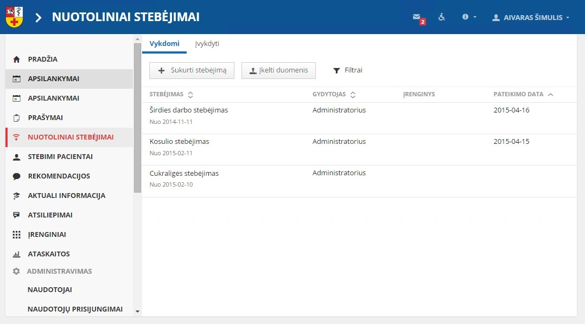
    <figcaption>3.1.1 Patient remote observation list page</figcaption>
</figure>

<figure>
	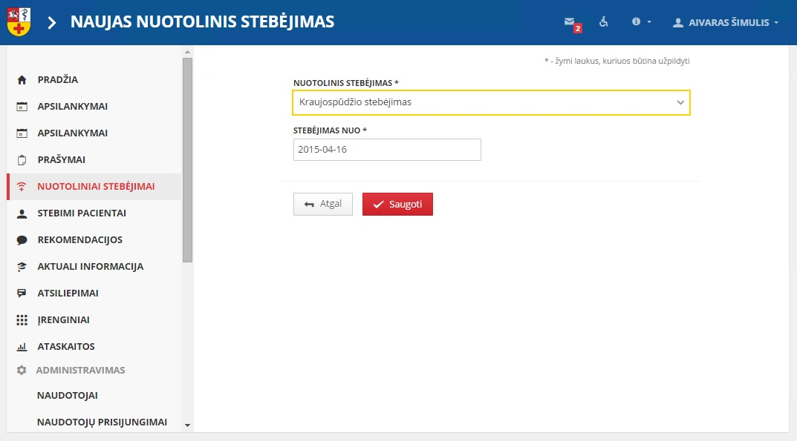
    <figcaption>3.1.2 Patient remote observation create page</figcaption>
</figure>

<figure>
	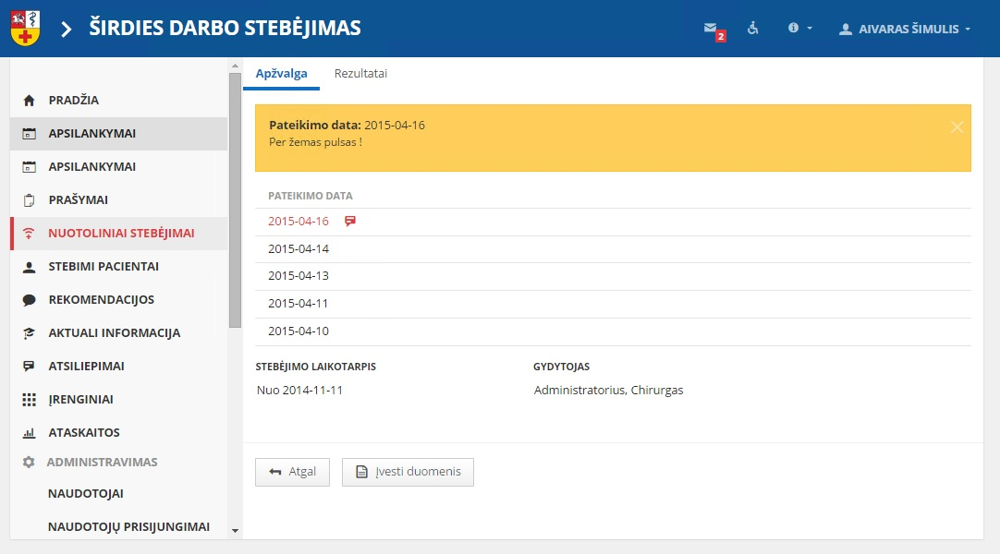
    <figcaption>3.1.3 Patient remote observation details page</figcaption>
</figure>

<figure>
	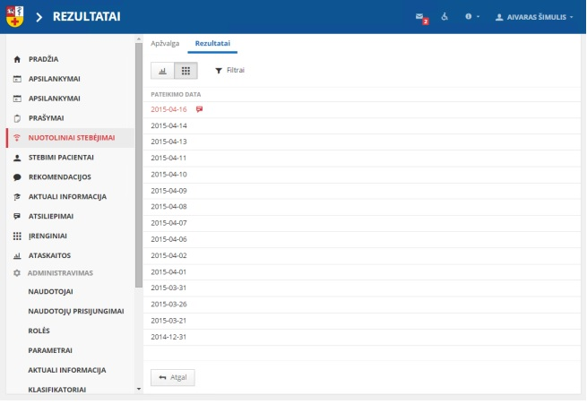
    <figcaption>3.1.4 Patient remote observation results page</figcaption>
</figure> 

<figure>
	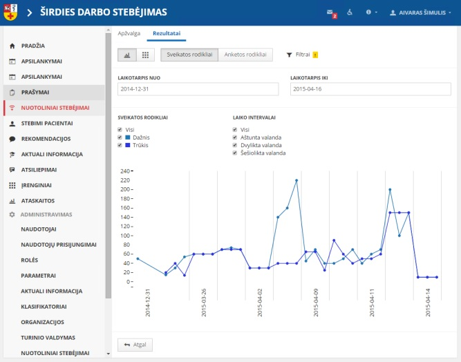
    <figcaption>3.1.5 Patient remote observation results graphic data visualization page</figcaption>
</figure>

<figure>
	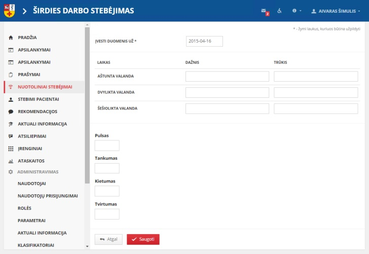
    <figcaption>3.1.6 Patient remote observation data input and filling page</figcaption>
</figure>

### Visit module
<figure>
	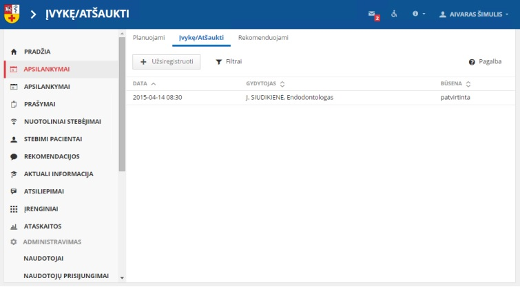
    <figcaption>3.2.1 Patient visit list page</figcaption>
</figure>

<figure>
	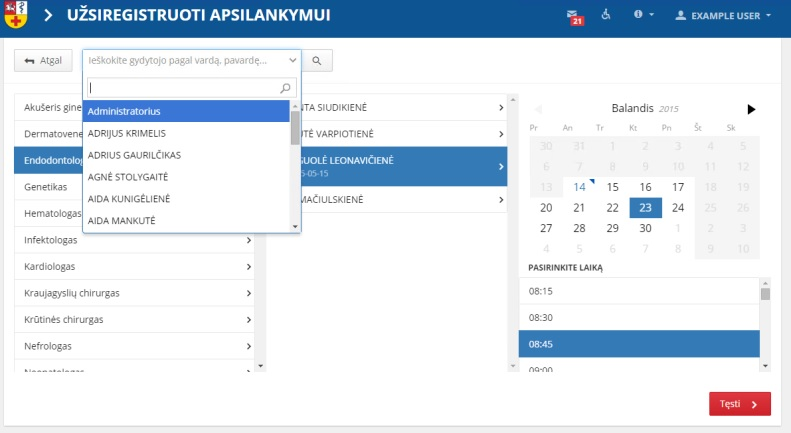
    <figcaption>3.2.2 Patient visit create page</figcaption>
</figure>

<figure>
	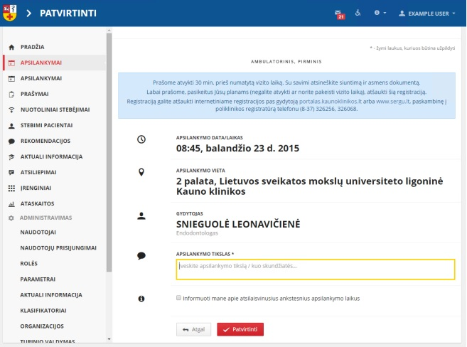
    <figcaption>3.2.3 Patient visit create page confirmation modal</figcaption>
</figure>

<figure>
	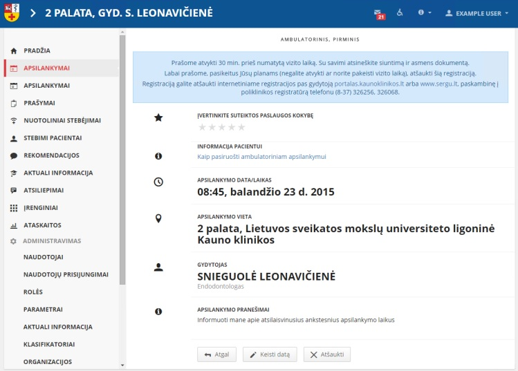
    <figcaption>3.2.4 Patient visit details page</figcaption>
</figure>

## Doctor use case 
### Remote observation module
<figure>
	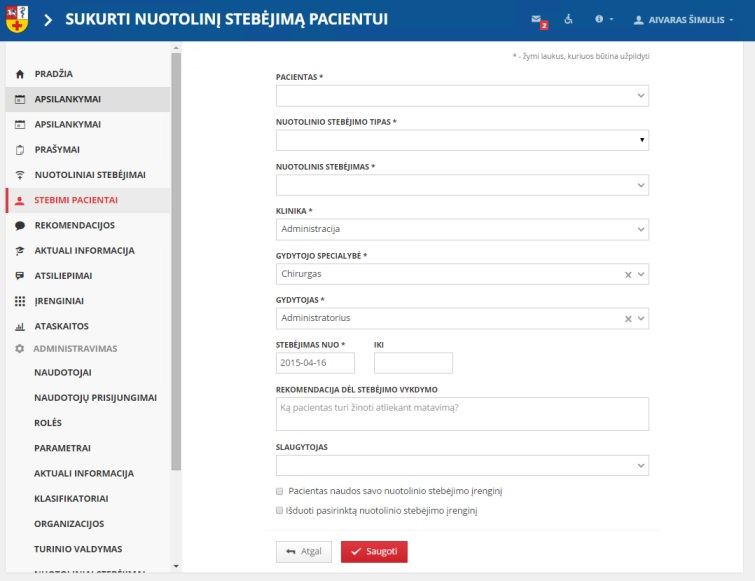
    <figcaption>3.3.1 Doctor remote observation create page</figcaption>
</figure>

<figure>
	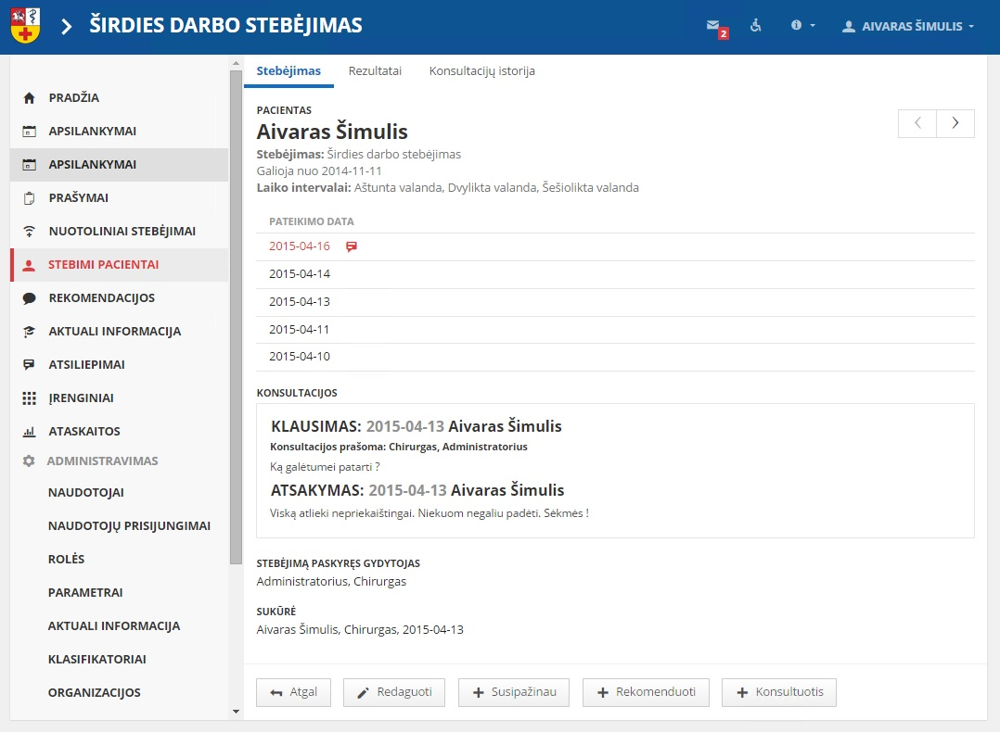
    <figcaption>3.3.2 Doctor remote observation details page</figcaption>
</figure>

<figure>
	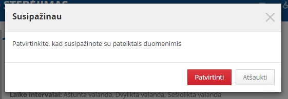
    <figcaption>3.3.3 Doctor patient remote observation data inspection</figcaption>
</figure>

<figure>
	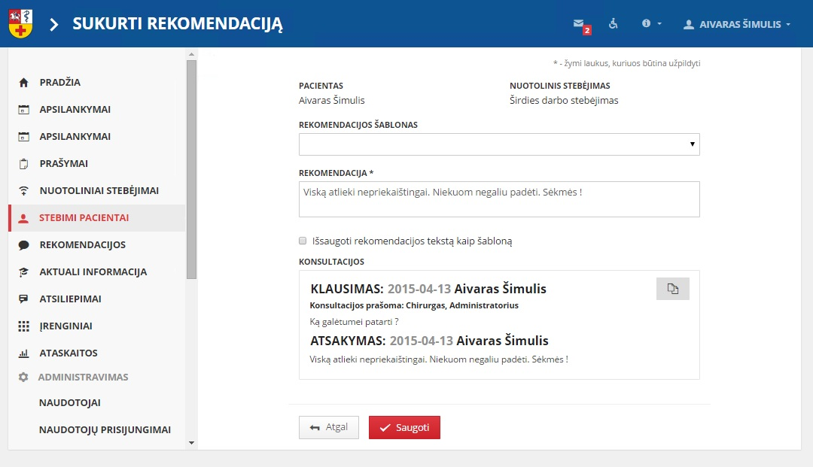
    <figcaption>3.3.6 Doctor written recommendation creation for patient</figcaption>
</figure>

<figure>
	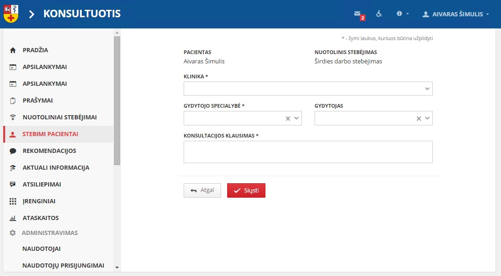
    <figcaption>3.3.5 Doctor consultation creation for another doctor</figcaption>
</figure>

## Administrator use case
### Device administrator
<figure>
	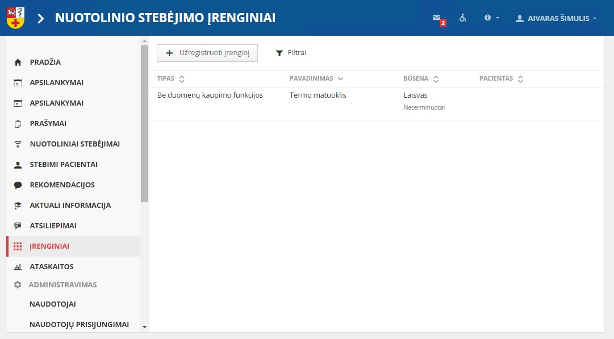
    <figcaption>3.4.1 Devices list page</figcaption>
</figure>

<figure>
	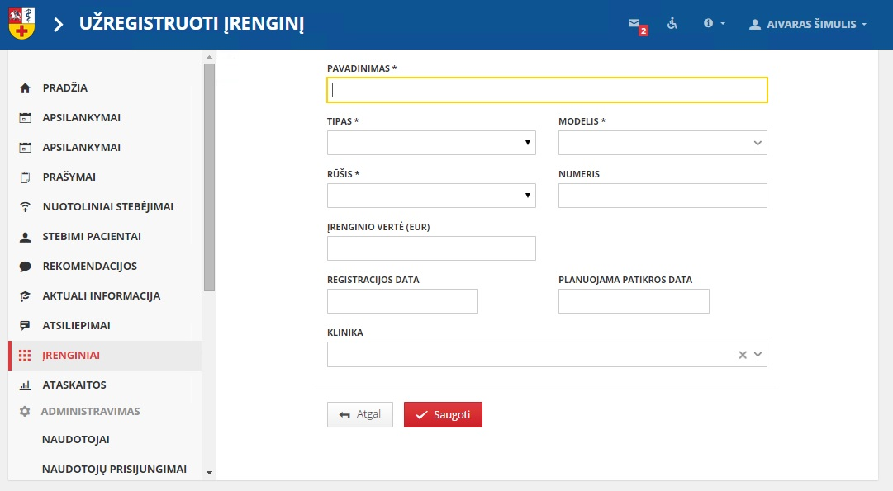
    <figcaption>3.4.2 New device create page</figcaption>
</figure>

<figure>
	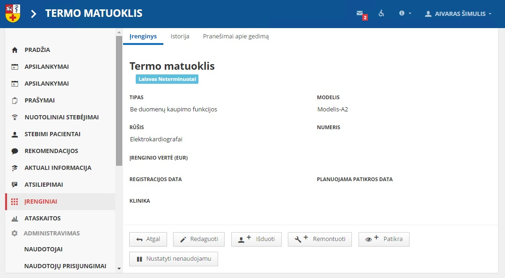
    <figcaption>3.4.3 Device details page</figcaption>
</figure>

### Education administrator
<figure>
	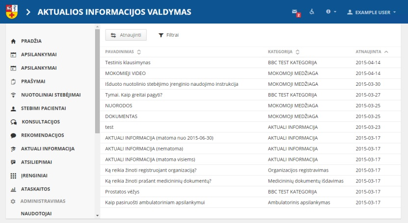
    <figcaption>3.4.4 Courses list details page</figcaption>
</figure>

<figure>
	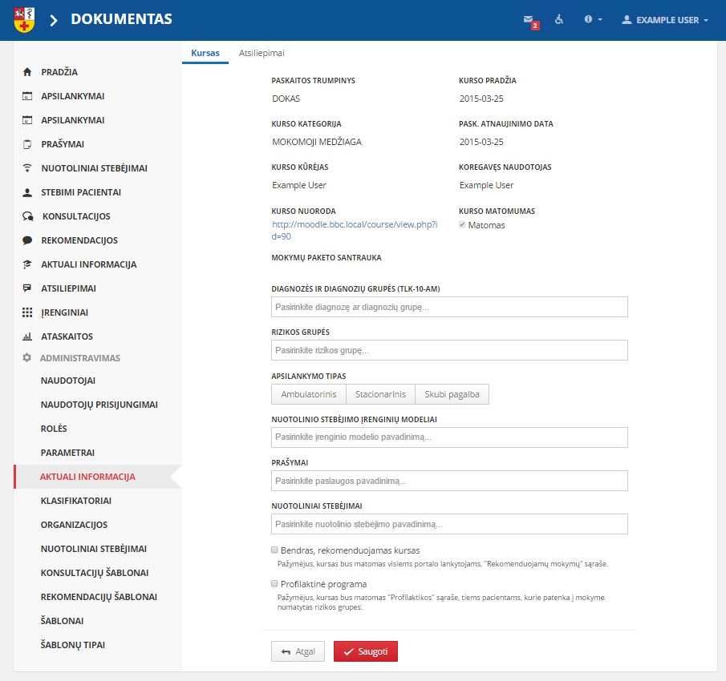
    <figcaption>3.4.5 Course edit page</figcaption>
</figure>
