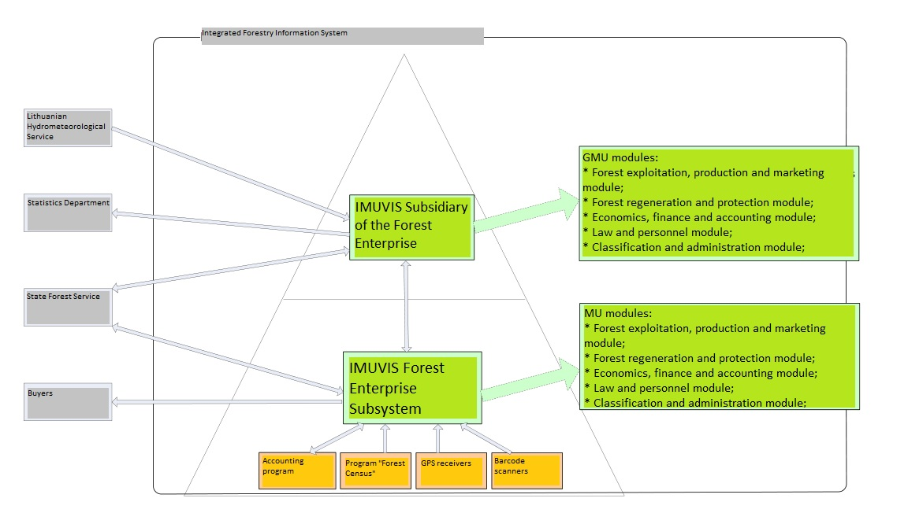
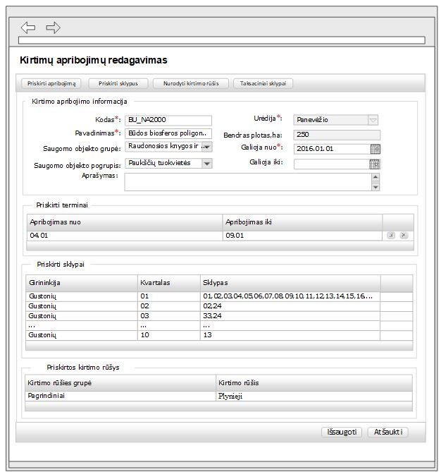
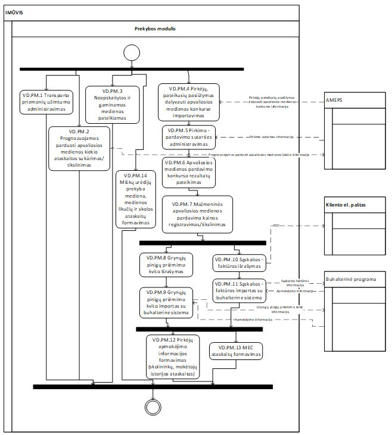

<figure>
	
</figure>

The accounting information system is designed for General State Forest Management to help accumulate accounting, analysis, activity information for forest enterprises. It is used for keeping and managing data relating to forest restoration, use, nursery activities, wood production, trade and other data gathering.

<h2>Contents</h2>
<ul>
    <li>
        <a href="#businessProblems">1. Business problems</a>
    </li>
    <li>
        <a href="#solution">2. Solution</a>
    </li>
    <li>
        <a href="#results">3. Results</a>
    </li>
</ul>

<h2 id="businessProblems">
    1. Business problems
    <a href="#businessProblems" aria-label="Anchor"> #</a>
</h2>

* Almost **15 different technologically obsolete** programs were used (since 1990);
* Data were **not accumulated in a centralized manner**;
* **4 different** accounting programs;
* **42 different** databases - difficult to install updates;
* Programs were **not suited for data security**;
* **Complicated** control of forest enterprises;
* **There were no data exchange** with other institutions;
* **No processes optimization** - data are filled several times repeatedly in different programs;
* **Reports** are generated **manually** - usually excel format;
* Biržai Municipality State Forest (and most other municipalities) used "FoxPro" platform, which was only supported by 2016.

<h2 id="solution">
    2. Solution
    <a href="#solution" aria-label="Anchor"> #</a>
</h2>

The technical specification document consisted of more than 1100 pages with almost 300 use case, process, activity, usability diagrams and more than 400 mockup schemes. Overall this project was quite massive in scope for its duration. 

As with other bigger projects I will try to convey basic information about what project was. Technical implementation details are known, but because of its scope it is quite difficult to write about every part.

#### Modules:
* Forest exploitation, production and marketing module;
* Forest regeneration and protection module;
* Economics, finance and accounting module;
* Law and personnel module;
* Classification and administration module;

#### Requirements
1) Forest use and production module:    
    * Administration of annual and standard annual logging rates;
    * Administration of the annual volume of stomachs for main felling;
    * Administration of Sortiment Management;
    * Establishment of Annual and Annual Reporting for Forest Cuttings;
    * Administration of quarters and plots;
    * Administration of limitation of cutting;
    * Administration of Exchange Information;
    * Assortment plan reports;
    * Administration of works and fees;
    * Partner administration;
    * Administration of forest service contracts;
    * Administration of Works Acts;
    * Management of timber warehouses;
    * Administration of warehouse balances;
    * Administration of the Stock Execution Technology Card;
    * Administration of wooden billboards;
    * Administration of the cutting pass act;
    * Administration of Economic Activity Reports.

2) Forest Commerce Module Functional Requirements:
    * Administration of Transport Employment Registration;
    * Administration of bidding proposals submitted by tenderers for Roundwood Competition;
    * Administration of sales contracts;
    * Management of retail sales prices of round timber;
    * Administration of payment documents;
    * Sales Module Reports;
    * Managing Assortment Plan Reports;
    * Classifiers and their meanings.

#### System implementation steps:
* Signed contracts by State agency for system implementation;
* Receive a mandate to allow the creation of the system;
* Prepare techinal specifiaction of the system;
* Prepare technical task for the system;
* Tailor public procurement conditions for system creation and instalation;

<figure>
	
    <figcaption>Logical architecture diagram</figcaption>
</figure>

<figure>
	
    <figcaption>Mockup example</figcaption>
</figure>

<figure>
	
    <figcaption>Activity diagram example</figcaption>
</figure>

#### Skills 
Estimated skill set used for this project: **ASP.NET MVC, C#, LINQ, HTML5, CSS, Telerik UI and Reporting, JavaScript, TSQL, GIT**

Estimated tools used for this project: **Visual Studio 2015, MS SQL Server 2014**

#### Development/Testing approach and principles

#### Roles and Responsibilities
Project Visionary, Project Sponsor, Project Manager, Technical Coordinator, Team Leader, Business Ambassador, Business Analyst, Infrastructure, Principal Developer, **Solution Developers (Me and my 5 colleagues)**, Solution Testers, Business Advisors (Architect, DBA, Apps Support, Finance, CST/Ops, HR), Workshop Facilitator **Overall ~8 Team members and ~15 other staff members.**

<h2 id="results">
    3. Results
    <a href="#results" aria-label="Anchor"> #</a>
</h2>

This time I don't have to share any page views of the finished system, because quite some time had passed when we finished this project. Also this project was for internal purposes, so it is not publicly available.

* Ensured the optimization of forest management processes;
* Ensured the storage of all necessary data in a unified database, data transmission and integration with automated processes;
* Informaction is filled once and fully complies with its operational needs in management, control, analysis and reporting tasks;
* Control and analysis in all subsystems, data exchange between forest enterprises and other institutions;
* Operational availability of data and improved the satisfaction of informations need of users, in accordance with their rights;
* Data security and recovery opportunity;
* Report formation and control;
* Optimization of human resources.
