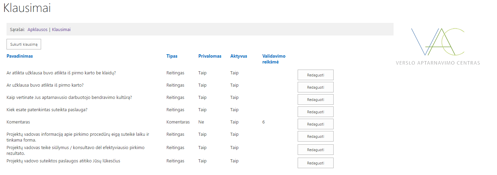
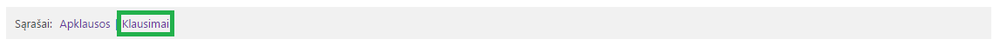
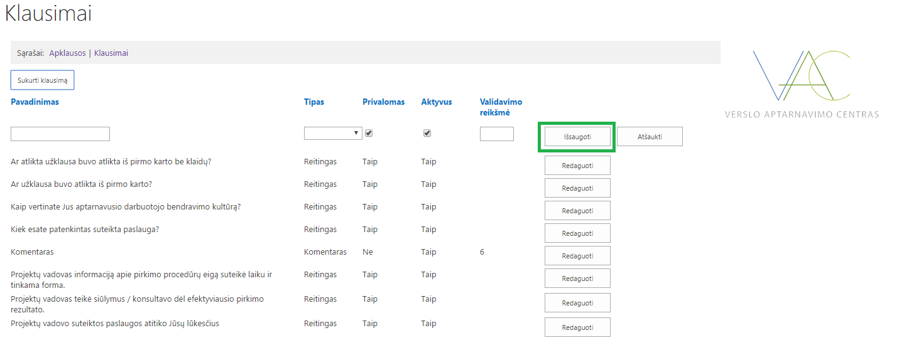
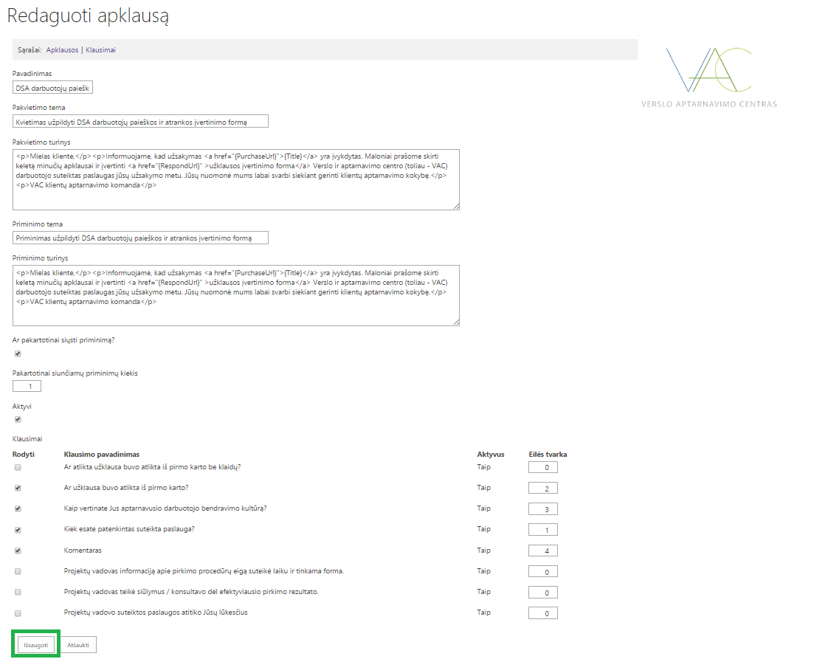
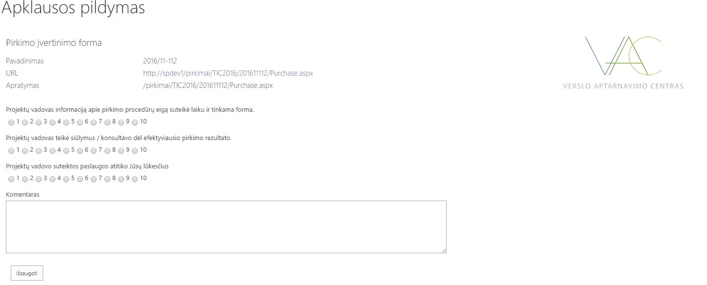
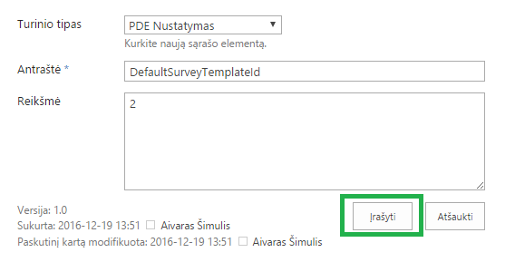
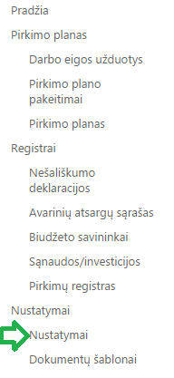

<figure>
	
</figure>

The purpose of this project was to create several sharepoint site pages and add them to an existing Sharepoint infrastructure solution. 

<h2>Contents</h2>
<ul>
    <li>
        <a href="#businessProblems">1. Business problems</a>
    </li>
    <li>
        <a href="#solution">2. Solution</a>
    </li>
    <li>
        <a href="#results">3. Results</a>
    </li>
</ul>

<h2 id="businessProblems">
    1. Business problems
    <a href="#businessProblems" aria-label="Anchor"> #</a>
</h2>

Organization wanted to add new Sharepoint to their existing solution. All the new pages would help to solve company's goal to form questionnaires and several types of fees reports for their own use.

<h2 id="solution">
    2. Solution
    <a href="#solution" aria-label="Anchor"> #</a>
</h2>

#### Skills 
Estimated skill set used for this project: **Sharepoint 2014, C#, HTML5, CSS, Sharepoint CSS library, React, JavaScript, GIT**

Estimated tools used for this project: **Visual Studio 2015**

#### Roles and Responsibilities
Project Sponsor, Project Manager, Principal Developer, **Solution Developers (Me and my colleague)**, Solution Testers, Business Advisors **Overall ~3 Team members and ~5 other staff members.**

<h2 id="results">
    3. Results
    <a href="#results" aria-label="Anchor"> #</a>
</h2>

* Created Sharepoint questionnaires solution to view, create and manage their own questionnaire types with various types of inputs;
* Created several types of fee report forms with dynamical field loading, settings and other various individual key features;

<figure>
	
    <figcaption>Result example 1</figcaption>
</figure>

<figure>
	
    <figcaption>Result example 2</figcaption>
</figure>

<figure>
	
    <figcaption>Result example 3</figcaption>
</figure>

<figure>
	
    <figcaption>Result example 4</figcaption>
</figure>

<figure>
	
    <figcaption>Result example 5</figcaption>
</figure>

<figure>
	
    <figcaption>Result example 6</figcaption>
</figure>

<figure>
	
    <figcaption>Result example 7</figcaption>
</figure>