<figure>
	
</figure>

Private business portal which mission is to provide digital e-commerce solutions for buyers and suppliers.

<a href="https://viacorex.com/" target="_blank">Visit website</a>

<h2>Contents</h2>
<ul>
    <li>
        <a href="#businessProblems">1. Business problems</a>
    </li>
    <li>
        <a href="#solution">2. Solution</a>
    </li>
    <li>
        <a href="#results">3. Results</a>
    </li>
</ul>

<h2 id="businessProblems">
    1. Business problems
    <a href="#businessProblems" aria-label="Anchor"> #</a>
</h2>

Company wanted to transfer from usual, standard, non-automatic and physical processes to more appealing digital ones and improve their services for wider audiences, with more authentic functionality and opportunities not only for themselves, but also for their clients.

<h2 id="solution">
    2. Solution
    <a href="#solution" aria-label="Anchor"> #</a>
</h2>

I overtook this project from one of my colleagues. At that time it had only two functioning modules with basic implementation: Tenders and Bids. Front-end was written with KnockoutJS, Javascript, Bootstrap 2.0 and Jquery. Back-end consisted of ASP.NET MVC, Entity framework, SQL Database, Azure infrastructure.

#### Requirements
Requirements came with time. Before beginning each development process, wide analysis process were made which involved not only analist, but also several other companies or users. After each modules development process and in-depth testing, the functionality was reviewed, users had a chance also to test it for their needs on a DEMO environment and give us a response or anything what else they wanted. So whole requirements came straight from our most important users and the main client - company.

Project began in 2013, so over its development we implemented more than 10 modules:

<figure>
	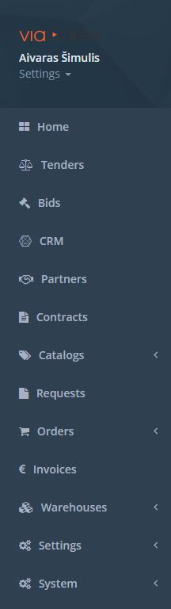
    <figcaption>Available system modules and services </figcaption>
</figure>

* Bought, used and upgraded system SSL certificates;
* Implemented Azure Blob Storage for system images and document storage;
* Email sending;
* Chat implementation;
* Service jobs with Hangfire;
* Push and system notifications;
* Build, deployment scripts, processes and tools;
* Localization;
* Authentication and Authorization;
* and many more... when remembered it will be written here!;

#### Skills 
Estimated skill set used for this project: **ASP.NET MVC, Entity Framework, C#, LINQ, HTML5, CSS, Bootstrap (2.0-3.0), JavaScript, KnockoutJS, Angular 1.5, JQuery, GIT, WCF, TSQL, Azure, Hangfire**

Estimated tools used for this project: **Visual Studio 2015-2017, MS SQL Server 2014, Trello**

Scale as needed by using Azure solutions and services: App services, storage account, team services account, SendGrid account, classic dev services and account, scheduler job collection, SQL Server, SQL Database, Blob Storage.

#### Roles and Responsibilities
Project Sponsor, Principal Developer, **Solution Developer (Me)**, Solution Testers **Overall ~2 Team members and ~2 other staff members.**

Other team members management, support and help as advisor;

<h2 id="results">
    3. Results
    <a href="#results" aria-label="Anchor"> #</a>
</h2>

* Implemented more than 10 different e-commerce services: Dashboard, Tenders, Bids, CRM, Partners, Contracts, Catalogs, Requests, Orders, Invoices, Warehouses, User settings, System settings and monitoring and a lot more sub-systems and specific functionality for each of these;
* Allowed to easily track and fulfill orders in one place and synchronize companies inventory and warehouse;
* Manage purchase and sales catalogs and their prices;
* Create orders and knew what stock is located where across multiple warehouses;
* Organize all companies relationships, contracts, tasks and notes in one place;
* Customize e-commerce portal for every business client;
* Access financing and payment solutions in invoices solution;
* Empowered more companies and their partners to do business online;
* Automated time-consuming tasks to help companies to concentrate on developing their brand;
* Streamlined up to 90% of companies productivity and processes;
* Provided deep insights into business performance;

#### Product Catalog
Manage all your products with a modern, digital product catalog displayed with high-resolution images, multiple view options, and product descriptions. You can even view inventory stock levels for each of your items, so you know what’s in stock.

Organize your items by the categories or groups of your choice for a more efficient browsing experience.

With search function, you can just type only part of the name, description or SKU of any product to quickly jump to exactly what you’re looking for.
Each product might be edited to include information such as name and description, multiple images, SKU codes, barcode, supplier code, buy price and multiple sales price lists.

You can upload and update product info in a few ways:

For one-off updates – like changing a price or uploading a new product image –click on the Products and edit an item.
For bigger uploads or updates, use our bulk import option to upload your products using an Excel spreadsheet. Most people take user our bulk import option when first setting up their ViaCorex account.
The third option to manage your catalog data is a direct connection with your ERP software to give real-time data.

<figure>
	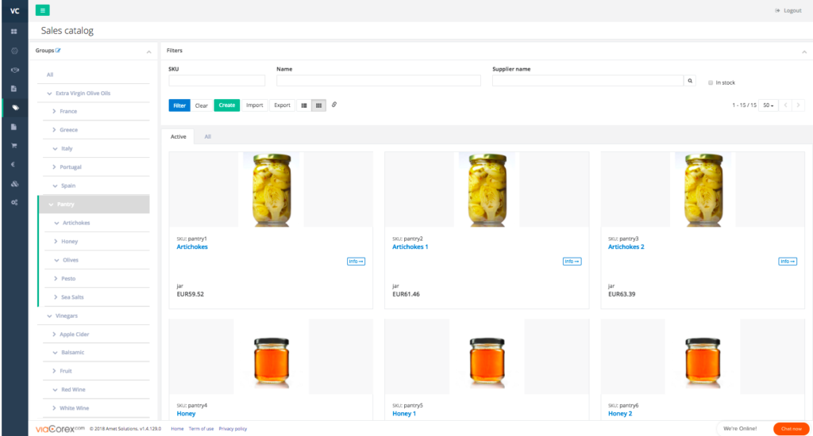
    <figcaption>Product Catalog</figcaption>
</figure>

#### Dedicated Catalogs

Dedicated catalogs for each client – you may have some products that you only sell to select clients or others that you are no longer selling and need to archive.

So each client can see and buy only the products in your catalog that apply to them. As a result, your sales representatives and clients can easily search and immediately find the right products; enhancing your sales conversions. These tools give you controls that allow you to choose the products you make available for sale in the  B2B eCommerce portal.

<figure>
	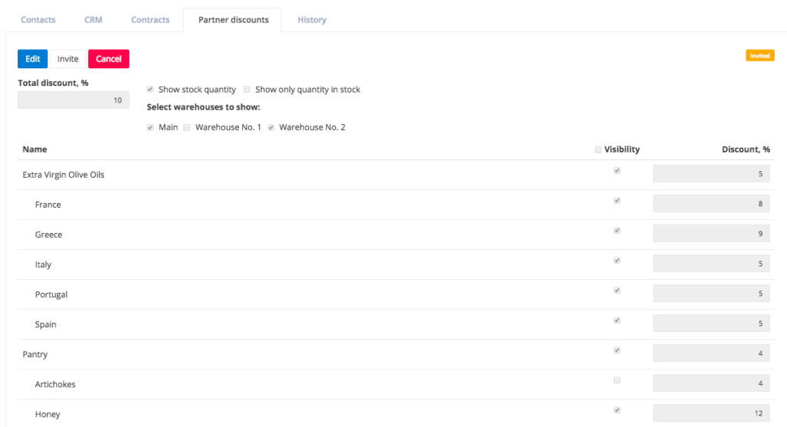
    <figcaption>Dedicated Catalogs</figcaption>
</figure>

####Dedicated Price Lists

System allows you to set up custom pricing configurations for different customers:
* Customer-specific price lists.
* Manage customer-specific discounts for each product group or subgroup.
* You can even assign different items names for specific customers.
* Pricing options you can manage manually for each item or can upload bulk price list using an Excel spreadsheet.
* It is no more necessary to fumble through price sheets or memorize complex pricing schemes. All of your pricing info is current and valid in ViaCorex.

<figure>
	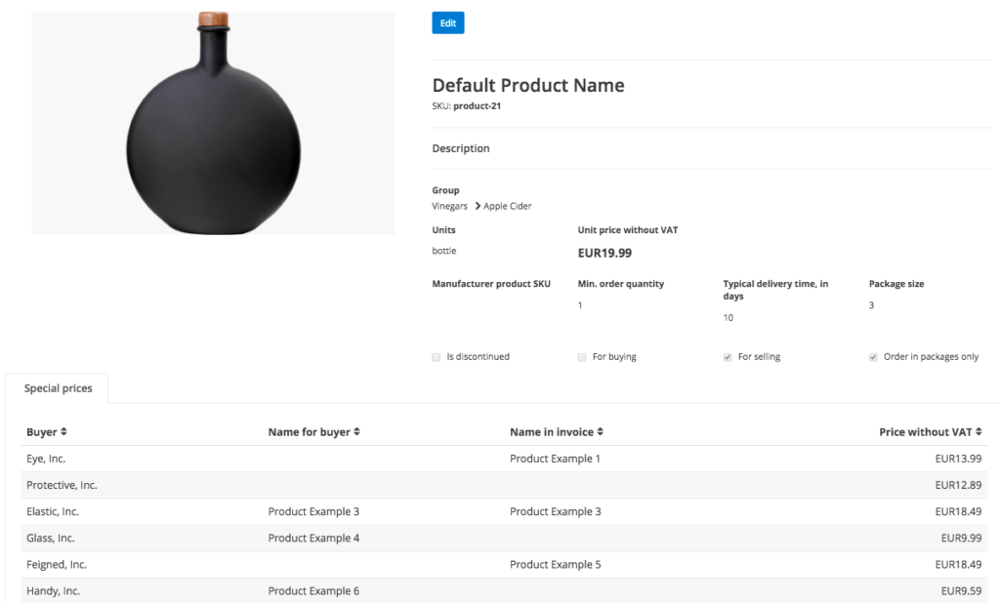
    <figcaption>Dedicated Price Lists</figcaption>
</figure>

#### B2B e-commerce
Stop mailing or waiting for your sales representatives to visit customers to show off your product catalog. Gone are the days of paper, PDF or Excel catalogs that are generic and often outdated.

Stay up-to-date and cutting edge with a B2B portal of your products that are designed specifically for each of your customers. Show them only the products that are suitable for them and with customer-specific pricing, HD images, rich product information and stock availability.

ViaCorex’s B2B portal helps you stand out by providing customers with 24/7 simple online self-service experience.

Your customers are busy managing the day-to-day processes of their business. They don’t enough have time to wait on hold with client service to order products.

On their own time, your customers can make purchases, educate themselves about your products and brand, and check basic account details like order status just like they do as online consumers without any additional training. Even better, it improves customers loyalty by making it even easier to do business with you.

<figure>
	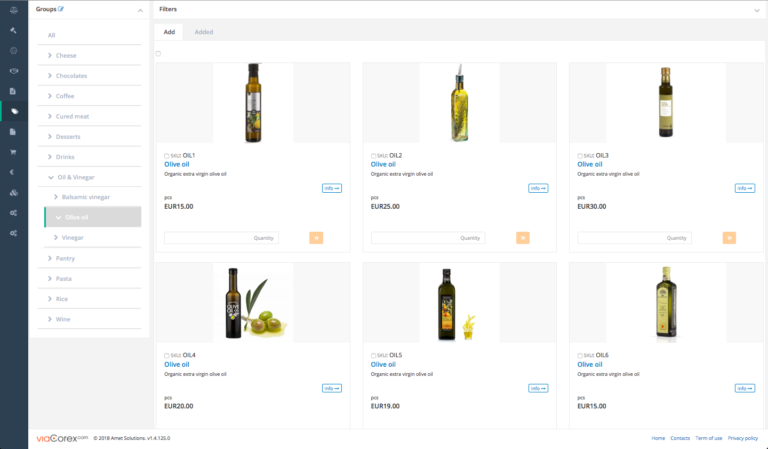
    <figcaption>B2B e-commerce</figcaption>
</figure>

#### Inventory & Warehouse Management
Manage your inventory efficiently across various locations and warehouses, all on a single platform. View all your products as a complete list. Every product on the menu displays stock on hand (for each location), awaiting deliveries or orders fulfilling (for each location), and sales and purchase orders history for enhanced inventory control.

**LOT numbers and expire date tracking**.
Improve product traceability with LOT numbers and keep track of their journey throughout sales orders, stock movements and product recalls. Keep track of what items are expiring soon to communicate and empower your sales team to sell off fast expiring stock.

**Barcode**.
Save time and minimize manual errors by using barcode scanning for receipting purchase orders, stock counts, and sales shipments.
If your supplier is using GS1 type barcodes (aka EAN/128), ViaCorex can extract LOT numbers and Expire dates and fulfill inventory and stock entries.

**Warehouses**
**Transfer stock between warehouses**.
Quickly create a stock transfer document and shift stock between your warehouses.

<figure>
	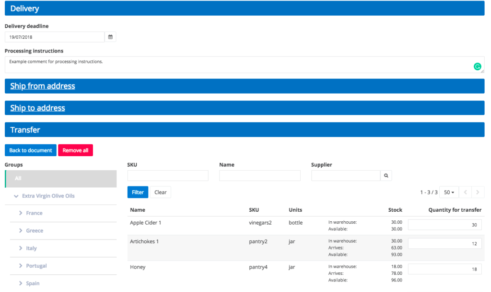
    <figcaption>Inventory transfering</figcaption>
</figure>

**Receive stock into a specific warehouse**.
On purchase orders, you can specify the warehouse anywhere you wish to receive the stock. When the purchase order is permitted, it will direct the stock to that location.

<figure>
	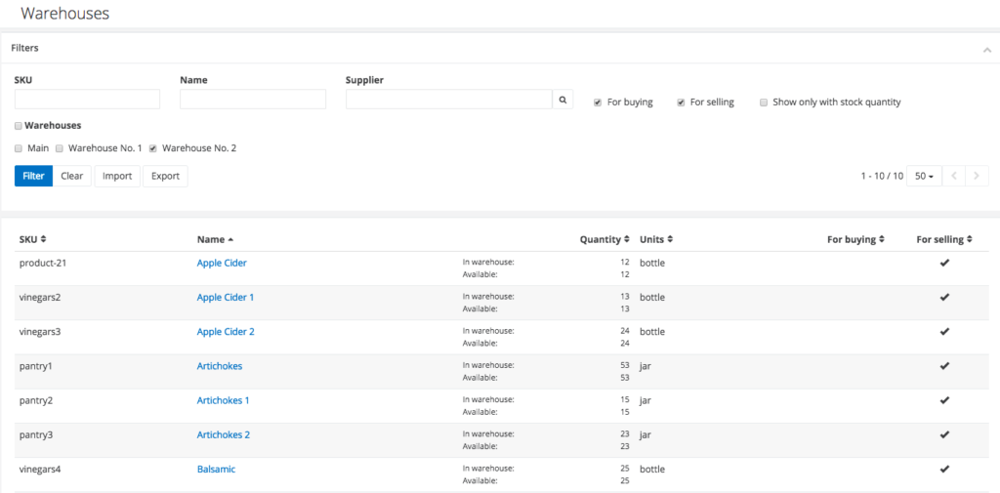
    <figcaption>Multiple warehouses</figcaption>
</figure>

**Fulfill orders from a particular warehouse**.
On sales orders, you can specify the location you want to send goods from. The stock from that location will automatically decrease when the sales order is accomplished.

**Sell on consignment**.
Set up a stock location and do a stock transfer to move stock into that consignment location. You can then create sales orders from that location.

<figure>
	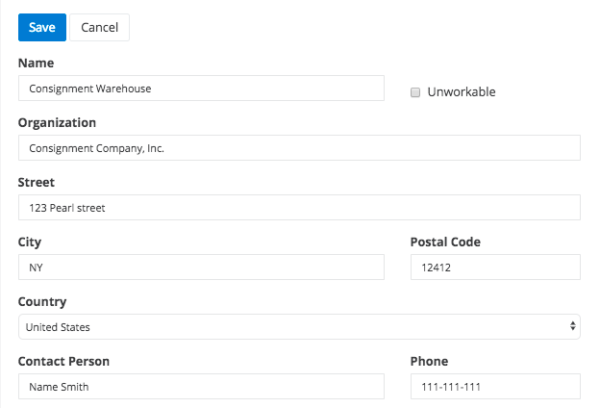
    <figcaption>Warehouse info</figcaption>
</figure>

#### Order Management
Sales and purchase orders management allows you to streamline your business processes without needing to cross-reference complicated spreadsheets.

Create sales orders when you are visiting customers, or from customers’ requests, once you’ve created a sales order, you can send it to your customer by email for confirmation.
Orders from your B2B portal are added automatically to your order list when you approve and fulfill them; your customer will see order statuses changes.

**Partial orders fulfill**.
Create a partial shipment in sales orders when only some products of order are shipped, and create a partial invoice alongside it.
If a purchase order is partially received select the lines you received, or the quantity per line.

<figure>
	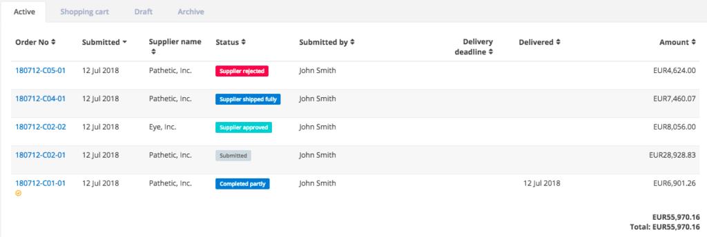
    <figcaption>Order status</figcaption>
</figure>

**Backordering**.
Purchase orders can be created from a sales order when you don’t have sufficient stock. With backorders, all sales orders for an unavailable item can be consolidated and converted to one purchase order per supplier.

####Invoicing

Create invoices from orders by simply one click and send an invoice to customers directly from ViaCorex. Also, you can generate proforma invoices and credit notes.

**Split invoicing**.
You can now invoice part of a Sales Order (partly fulfilled) without having to split it into multiple orders.

**Combine invoices**.
If your customer wants to receive only one invoice – you can combine multiple sales orders into one invoice

With integration to your accounting system, you don’t need to re-enter invoices manually.

**Invoice templates**.
Create and use multiple templates for different locations, languages or taxes. Also, ViaCorex supports multiple taxes in one invoice.

<figure>
	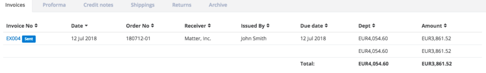
    <figcaption>Order status</figcaption>
</figure>

####Invoice Factoring

Integrated factoring solution provided by our partner SME Finance. Monthly interest rate from 1%, credit limit up to 750.000 €.

* Apply – in one click, by submitting an auto-filled form with essential details about your business directly from ViaCorex.
* Get approved – Your application will be reviewed and reached out with a decision in as fast as 24 hours.
* Select and submit invoices in a few clicks and get up to 100% of the money upfront.
* Access more capital
* Fund only what you want, you decide how many and which invoices to submit. Fund only when you need, without long-term contracts.

<figure>
	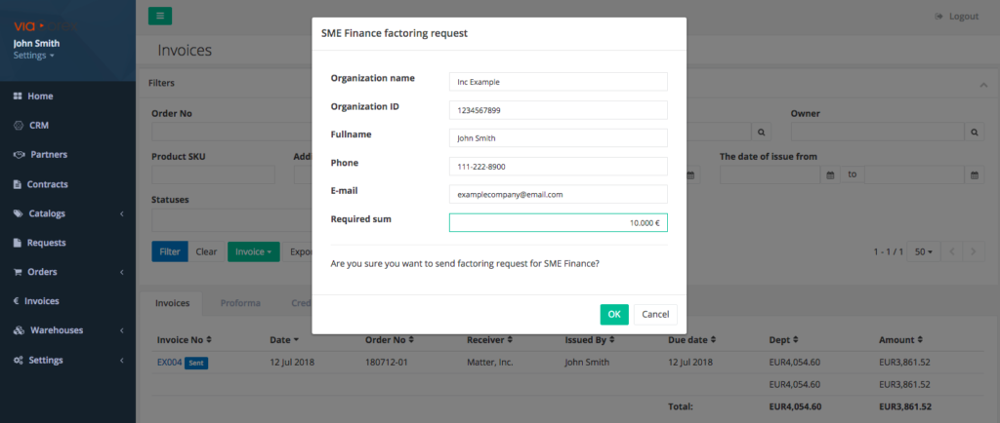
    <figcaption>Factoring</figcaption>
</figure>
