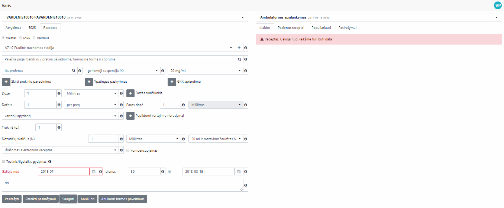

<figure>
	
</figure>

The main idea of the project is to offer various e-health services for hospitals and institutions by improving their workload time, performance and overall quality for patients and staff of the institution.

<h2>Contents</h2>
<ul>
    <li>
        <a href="#businessProblems">1. Business problems</a>
    </li>
    <li>
        <a href="#solution">2. Solution</a>
    </li>
    <li>
        <a href="#results">3. Results</a>
    </li>
</ul>

<h2 id="businessProblems">
    1. Business problems
    <a href="#businessProblems" aria-label="Anchor"> #</a>
</h2>

Medical institutions constantly are searching for ways to optimise their workload, reduce time needed to complete mandatory task, which can be automated by computers.

<h2 id="solution">
    2. Solution
    <a href="#solution" aria-label="Anchor"> #</a>
</h2>

#### Requirements
Requirements came straight from the business owner. It all started from an existing system rewrite and in need to simplify the existing solution even more. 

We started to create new system from the already existing one, so the entity of the system was already known and was familiar. Our goals was to make system work fast and users had to have great, and most importantly **clear** user experience by using newly created system.

Modules were implemented as follows: visit module, medical forms module prescription module, templates module, popular prescriptions module, prescription and forms sign module, payment module, reports module.

At the same time we had to have both: the old and the new system. After several months the user transition was done and the older system pages were refactored and removed from our code base.

#### Skills 
Estimated skill set used for this project: **.NET Core 2.1, C#, LINQ, HTML5, CSS3, Bootstrap (3.0-4.0), Typescript, JavaScript, ReactJS, Redux Forms, Redux, Redux Saga, NodeJS, JWT, MQRABBIT, Webpack, SignalR, Telerik Reporting**

Estimated tools used for this project: **Visual Studio 2017, Visual Studio Code, MS SQL Server 2014, Attlassian Jira, Trello, Microsoft Teams, Skype, Bitbucket.**

#### Roles and Responsibilities
Business Owner, Project Manager, Team Leader, Principal Developer, Software Architect, **8 Solution Developers (Me and my colleagues)**, 3 Solution Testers, **Overall ~14 Team members**

<h2 id="results">
    3. Results
    <a href="#results" aria-label="Anchor"> #</a>
</h2>

* Created Arrival tab (state of disobedience, visiting, E025 medical forms, dispatces, agreements, vouchers and tickets);
* Created E025 and E003 medical forms (complaints and anmnesis, objective evaluation, condition assessment, diagnoses, allergies, research consultation plan, performed laboratory instrumental studies, used medical treatment, performed surgical procedures, applied treatment, recommendations, vaccination appointments, notifications, newborn inspection, certificate of incapacity, notes);
* Created 3 different prescription forms: recipe, nominal recipe, MPP (illness, medicine search, appointment, dosage, dose calculator, daily dose, additional directions for use, prescription data, duration, information for patient). Actions to prepare sign, sign, save, cancel, reset, close, approve;
* Implemented sign mechanism for prescriptions and E-forms, communication and integration with other state systems;
* Created template functionality for variuos forms to reduce time for repetition and creation of simiral forms;
* Implemented observation dashboard page for institutions to display desired information in waiting, treatment rooms on big screens;
* Created paid services module, which allowed to form and add services or medication from catalog or individually for specific person to pay at later scale. Implemented payment solution;
* Integrated created modules and forms with other ESPBI systems (FORME027, EREC01, EVAI01);
* Created reporting module by using Telerik Reporting tools, dashboards, different types of reports creation, archive, viewability, groups and users management, jobs and tasks cycle;
* Created UI form components (Sortable, CheckBoxField, DateTimeField, DropDownField, MultipleField, NumberField, PasswordField, RadioButtonListField, RichTextDisplay, TextField, TextAreaField, etc.) and various form structure components for reusability in different places in the project;

<figure>
	
    <figcaption>Login page</figcaption>
</figure>

<figure>
	
    <figcaption>Receipt view</figcaption>
</figure>

<figure>
	
    <figcaption>Errors tab view</figcaption>
</figure>

<figure>
	
    <figcaption>Buying products page</figcaption>
</figure>

<figure>
	
    <figcaption>Dashboard for institutions</figcaption>
</figure>

<figure>
	
    <figcaption>React components storybook</figcaption>
</figure>

<figure>
	
    <figcaption>Reports dashboard</figcaption>
</figure>

<figure>
	
    <figcaption>Reports diagram</figcaption>
</figure>

<figure>
	
    <figcaption>Reports list</figcaption>
</figure>

<figure>
	
    <figcaption>Report creation</figcaption>
</figure>

<figure>
	
    <figcaption>Generated reports archive</figcaption>
</figure>

<figure>
	
    <figcaption>Generated report view</figcaption>
</figure>
