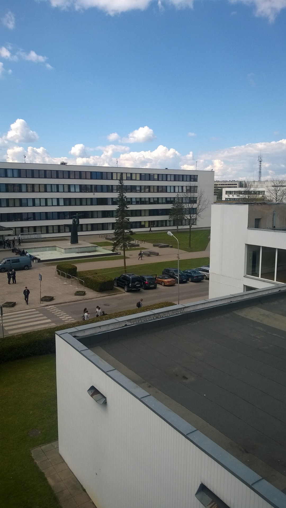
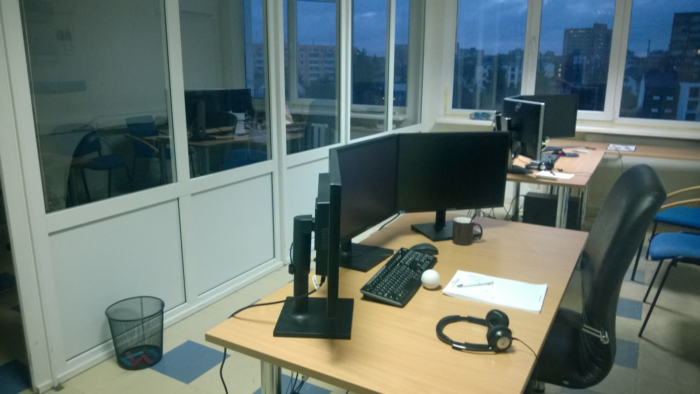
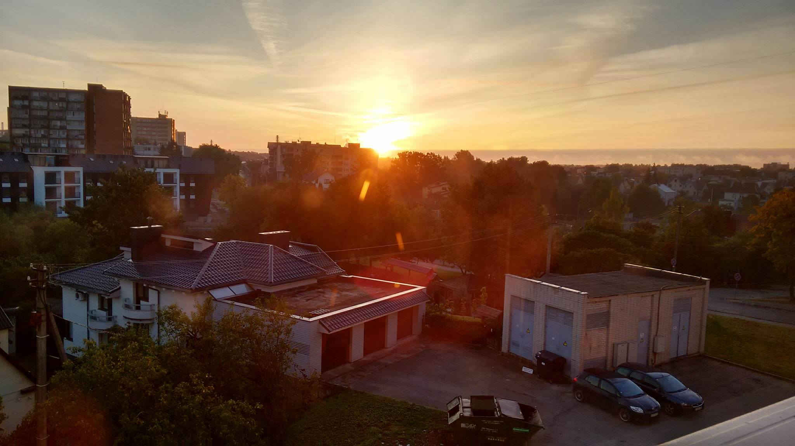

After the first real world job experience I proved to myself that I am capable of developing software in the real work environment. Working not only by myself or several close friends, but also with a solid sized team, socializing, discussing about problems, solutions, managing my time, productivity and well-being. I was proud to show my first official work experience and successful project on my resume. It was a big achievement for me. 

Long without waiting I updated my resume, LinkedIn profile, created new account for one of the Lithuanian job search sites. I uploaded my resume and just kept it there. For half a year I was further enrolled in my university studies, without any spare time or even more any thought about a job search. 

After I finished my university session, I was contacted by Amidus organization director, Darius, who found my resume on that lithuanian job site. After few e-mails he offered me to develop a sample movie database administration site with some key requirements for a DB, UI and back-end structure with that time technologies: ASP .NET MVC, Razor, Javascript, etc..  It was a selection process before an interview. After several hours spent on this project I was quite happy with it, but even then added a few more hours to polish it. As I was told, I was the first who sent it. 

<figure>
	
	<figcaption>First time here. Long impatient wait before my interview</figcaption>
</figure>

After few days I was contacted again for an interview. The workplace was near my home and university so it was an easy walk between each other. Interview passed smoothly. I was quite prepared because I recently had finished a book about <a href="https://github.com/Apress/pro-asp.net-mvc-4">ASP .NET MVC 4</a> book. I was promised that I will have a mentor, full-fledged support from my team members, learning tools for certification exams, project materials for Bachelors degree research project and free-time when I needed for my studies. 

<figure>
	
	<figcaption>My workplace</figcaption>
</figure>

Everything ideally correlated with my main set goal - gain more knowledge and experience. The work environment was good, university was just across the street, home about 300 meters. Time spent on commute was close to zero, which maximized my ability to spent more time on the things I valued the most - work, studies and sports. I worked overtime as I worked full-time and I needed to go out for my study sessions and exams. Spent hours in university, I compensated for more work in the evenings. It were challenging times but now I look at that period as one of the most productive things I have done in my lifetime and I am proud of it. 

<figure>
	
	<figcaption>View from the office window</figcaption>
</figure>

More talking about off-work experiences, there were plenty of them: foosball tournaments, free food pizza/sushi days, tea/coffee parties, game nights, sports events, snowboarding trips, summer and winter work holidays and Olympics between our offices located in Vilnius and Kaunas.

Organization members and team members all were friendly and interesting to talk with. Everyone had something to share or add. I cannot remember any situation which was with anger or disappointment. One of my biggest heroes was my mentor Adas. He was my inspiration and biggest motivation to someday grow as knowledgeable as he was and I mean it. So much support and help from his side was an awe dropping sight for me. It seemed that he knows pretty much everything and it communicates everything so clearly and it just clicks in the right places where it should. After his explanations everything seemed so obvious, but before - so hard. 

They really did what they had promised and told me - grew me to the size that I would become just like one of them and I promised to myself that for this kind gift I will be thankful for my entire career. Maybe that's why I am happy here - I feel rated and needed. Even if company is small by its size, but everyone here are kind, funny, experienced and down-earthed.

Every problem was solved, every request was permitted, I was given new and exciting projects to work with - I was happy, because once again I proved not only for myself but also to them that I brought tremendous value to the company also. Nothing is better than to feel evaluated.
