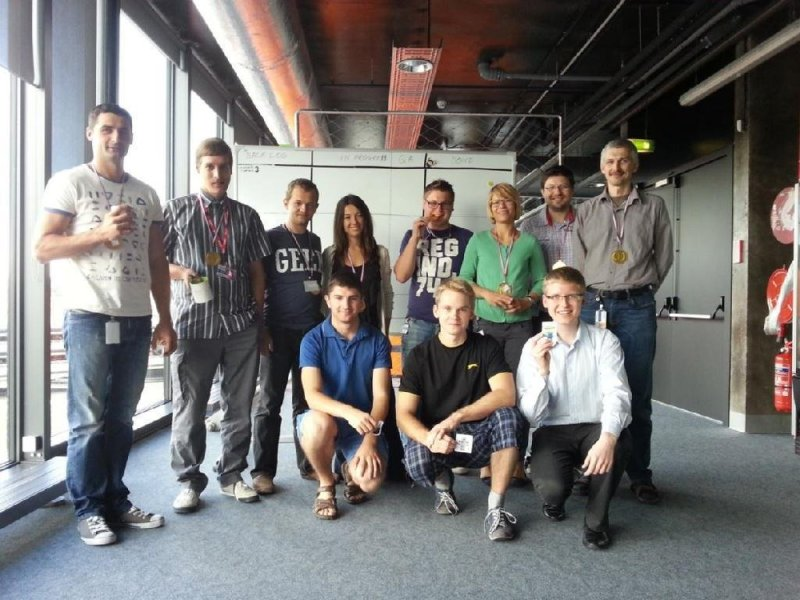

My journey into this company started in the summer of 2013. I was a second year student in the Kaunas University of Technologies. Still trying to learn as much as I can in my early days of studying IT, finishing my last exams of the study year and working hard to preserve my scolarship for another semester - which was a success. 

I was contacted by one of my study group members, Julius, with whom I was a great friend. He suggested this summer to find a job to gain even more first, real world and official work experience to take the first steps towards our careers. We decided to give it a shot, becauce we definately loved our work and were eager to learn anything new and as fast as we can. In our group we included one other great friend and study group friend, Tomas, and began looking for a company to our planned awesome summer vacations/work adventure. 

Callcredit was our main and first target. We ourselfes came forward for them and requested an opportunity for an internship positions and if they could let us work there for the summer. They were intrigued, suprised and bewildered at the same time by our desire to gain knowledge - that's what I think gave us an edge in this position, we were very young and enthusiastic.

We attended our motivational interview. We talked with the company director, HR manager, our intended project manager and the rest of our support and technical team members. It went really well. They aggreed to teach us, we even offered to work for free, just for the knowledge and eperience, but they felt too uncomfortable and even agreed to pay for us for our work. Following our recent conversations, they were delighted to make us an offer of internship in Software Engineering department. They were confident we will be a great asset to their successful team. Told us to expect to receive encouragement and support to help nurture the important skills that we brought to this role and thus creating a winning formula for the achievement of our own goals and those of the Company. 

For employment we needed to get Legal right to work confirmation, identity verification, address check, employment check, credit reference check, criminal records bureau check.

The work environment was top of the notch - large, spacious space, own desk, ergonomical chairs, a pair of monitors, all other required equipment for work, conditioner, free coffee and snacks, work events and holidays. Work hours from 9 to 18, but we even managed to prolong them to enjoy our work a bit longer in this short summer time span.

More information about work experience and the project we were working on, can be found <a href="../projects/employees-evaluation-system">here</a>.

Nearly came the end of the summer and the end of our internships. For the provided opportunity we bought for our whole team a big, delicious cake for the whole office and golden, chocolate medals for our all team members to symbolically thank them for their support.

<figure>
	
	<figcaption>The last day of the awesome summer internship</figcaption>
</figure>

The project and first company internship in Lithuania was a success. Julius remained to work there and I with Tomas continued to work toward our studies.
